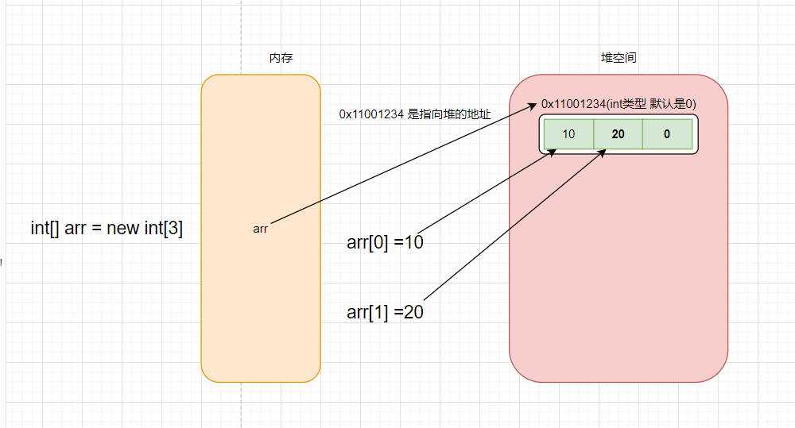

###  JavaSE 摸鱼第五天...

##### 1、安装摸鱼工具 IDEA

+ 超级简单的，傻瓜式安装...

2、从来不用的三种注释

##### 2.1、单行注释

```java
// 这是单行注释
```


##### 2.2、多行注释

```java
/*
多行注释1
多行注释2
*/
```


##### 3.2、文档注释

```java
/**
 * Created with IntelliJ IDEA.
 *
 * @author: ilovesshan
 * @date: 2022/6/16
 * @description:
 */

public class DefineArray {
    /**
     * 这是方法注释
     * @param args args
     */
    public static void main(String[] args) {
    }
}
```


#### 3、数组和数据结构

##### 3.1、定义数组

+ 使用数据可以帮助我们保存多个相同数据类型的数据。

+ 方式一

  ```java
  // 1、定义
  int[] nums;
  
  // 2、声明空间
  nums = new int[5];
  
  // 3、赋值
  nums[0] = 0;
  nums[1] = 2;
  ```

  

+ 方式二

  ```java
  // 1、定义加声明空间
  int[] num2 = new int[5];
  
  // 2、赋值
  num2[0] = 0;
  num2[1] = 2;
  
  ```

  

+ 方式三

  ```java
  // 1、定义直接赋值
  int[] num3 = new int[]{0, 1, 2, 3, 4};
  ```

  

##### 3.2、数组在内存表现形式(简易)



##### 3.3、数组注意事项

+ 数组有一个属性`length` 可以获取数组的长度，获取nums数组最后一个元素可以使用`nums[nums.length-1]`
+ 数组的下标默认从`0`开始、下标永远不会存在负数
+ 数组除了可以保存基本数据类型外 还可以保存引用数据类型
+ 声明数组时、需要声明空间大小之后才能赋值
+ 声明数组时、放入的不同数据类型都有不同的默认值
  + byte、short、int、long 默认值是 0
  + float、double 默认值是 0.0
  + boolean 默认值是 false
  + char 默认值是 \u0000(空串)
  + String 默认值是 null

##### 3.4、简述数据结构

+ 简单一句话概括就是：按照一定的顺序将数据存放起来。后期慢慢体会....

#### 2、数组常见的操作