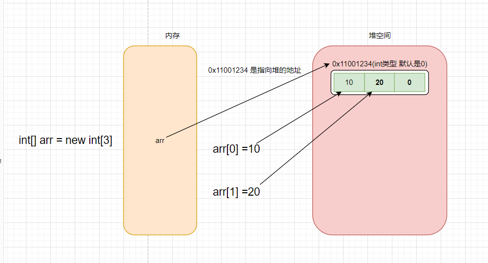

###  JavaSE 摸鱼第五天...

#### 1、安装摸鱼工具 IDEA

+ 超级简单的，傻瓜式安装...

2、从来不用的三种注释

##### 2.1、单行注释

```java
// 这是单行注释
```


##### 2.2、多行注释

```java
/*
多行注释1
多行注释2
*/
```


##### 3.2、文档注释

```java
/**
 * Created with IntelliJ IDEA.
 *
 * @author: ilovesshan
 * @date: 2022/6/16
 * @description:
 */

public class DefineArray {
    /**
     * 这是方法注释
     * @param args args
     */
    public static void main(String[] args) {
    }
}
```


#### 3、数组和数据结构

##### 3.1、定义数组

+ 使用数据可以帮助我们保存多个相同数据类型的数据。

+ 方式一

  ```java
  // 1、定义
  int[] nums;
  
  // 2、声明空间
  nums = new int[5];
  
  // 3、赋值
  nums[0] = 0;
  nums[1] = 2;
  ```

  

+ 方式二

  ```java
  // 1、定义加声明空间
  int[] num2 = new int[5];
  
  // 2、赋值
  num2[0] = 0;
  num2[1] = 2;
  
  ```

  

+ 方式三

  ```java
  // 1、定义直接赋值
  int[] num3 = new int[]{0, 1, 2, 3, 4};
  ```

  

##### 3.2、数组在内存表现形式(简易)



##### 3.3、数组注意事项

+ 数组有一个属性`length` 可以获取数组的长度，获取nums数组最后一个元素可以使用`nums[nums.length-1]`
+ 数组的下标默认从`0`开始、下标永远不会存在负数
+ 数组除了可以保存基本数据类型外 还可以保存引用数据类型
+ 声明数组时、需要声明空间大小之后才能赋值
+ 声明数组时、放入的不同数据类型都有不同的默认值
  + byte、short、int、long 默认值是 0
  + float、double 默认值是 0.0
  + boolean 默认值是 false
  + char 默认值是 \u0000(空串)
  + String 默认值是 null

##### 3.4、简述数据结构

+ 简单一句话概括就是：按照一定的顺序将数据存放起来。后期慢慢体会....

#### 2、数组常见的操作

##### 2.1、小试牛刀 遍历数组

```java
public class IteratorArray {
    public static void main(String[] args) {
        int[] ints = new int[]{10, 20, 30, 1, 0, 2, 45, 788, 45, 1, 5};

        // for 循环
        for (int i = 0; i < ints.length; i++) {
            System.out.println(ints[i]);
        }

        // while 循环
        int i = 0;
        while (i < ints.length) {
            System.out.println(ints[i]);
            i++;
        }
    }
}
```


##### 2.2、找元素 存不存在

```java
public class FindElement {
    public static void main(String[] args) {
        int[] ints = new int[]{10, 20, 30, 1, 0, 2, 45, 788, 45, 1, 5};
        int findIndex = -1;

        // 要寻找的元素
        int target = 0;


        for (int i = 0; i < ints.length; i++) {
            if (target == ints[i]) {
                findIndex = i;
                break;
            }
        }
        if (findIndex == -1) {
            System.out.println("啊额、没找到...");
        } else {
            System.out.println("找到了, 索引是: " + findIndex);
        }

    }
}

```


##### 2.3、找出数组中最大的元素

```java
public class FindMaxNum {
    public static void main(String[] args) {
        int[] ints = new int[]{10, 20, 30, 1, 0, 2, 45, 788, 45, 1, 5};

        int maxIndex = 0;

        for (int i = 1; i < ints.length; i++) {
            if (ints[maxIndex] < ints[i]) {
                maxIndex = i;
            }
        }

        System.out.println("最大元素下标是: " + maxIndex +", 对应值是: " + ints[maxIndex]);

    }
}
```


##### 2.4、交换数组元素

```java
public class ArrayExchangeElement {
    public static void main(String[] args) {
        int[] ints = new int[]{1, 2, 3, 4};
        // 将 ints数组中 2 和 3 交换位置

        int temp = ints[2];
        ints[2] = ints[1];
        ints[1] = temp;

        for (int i = 0; i < ints.length; i++) {
            System.out.println(ints[i]);
        }
    }
}

```


##### 2.5、数组扩容

```java
public class ArrayExpended {
    public static void main(String[] args) {
        int[] ints = new int[]{10, 20, 30};

        // 将ints长度+1, 让ints[3] = 40;

        int[] temp = new int[ints.length + 1];

        for (int i = 0; i < ints.length; i++) {
            temp[i] = ints[i];
        }

        ints = temp;

        ints[3] = 40;

        for (int i = 0; i < ints.length; i++) {
            System.out.println(ints[i]);
        }
    }
}

```


##### 2.6、数组反转

```java
public class ArrayReverse {
    public static void main(String[] args) {
        int[] ints1 = new int[]{10, 20, 30, 1, 0, 2, 45, 788, 45, 1, 5};
        int[] ints2 = new int[]{10, 20, 30, 1, 0, 2, 45, 788, 45, 1, 5};

        // 方式一
        int[] temp = new int[ints1.length];

        for (int i = 0; i < ints1.length; i++) {
            temp[i] = ints1[ints1.length - 1 - i];
        }
        ints1 = temp;

        for (int i = 0; i < ints1.length; i++) {
            System.out.println(ints1[i]);
        }


        // 方式二

        for (int i = 0; i < ints2.length / 2; i++) {
            int t = ints2[i];
            ints2[i] = ints2[ints2.length - 1 - i];
            ints2[ints2.length - 1 - i] = t;
        }

        for (int i = 0; i < ints2.length; i++) {
            System.out.println(ints2[i]);
        }
    }
}
```


#### 4、做个Management System的crud

```java
import java.util.Scanner;
public class ManagementSystem {
    static int command = 0;
    static String[] names = new String[]{};


    public static void main(String[] args) {

        while (true) {
            Scanner scanner = new Scanner(System.in);
            System.out.print("请输入指令 添加员工(1)/删除员工(2)/修改员工(3)/查询员工(4)/退出(-1) : ");
            command = scanner.nextInt();
            if (command == -1) {
                break;
            } else if (command == 1) {
                System.out.print("请输姓名 : ");
                String name = scanner.next();
                add(name);
            } else if (command == 2) {
                System.out.print("请输要删除的姓名 : ");
                String name = scanner.next();
                del(name);
            } else if (command == 3) {
                System.out.print("请输被修改姓名 : ");
                String beEdit = scanner.next();

                System.out.print("请输新的姓名 : ");
                String newName = scanner.next();
                update(newName, beEdit);
            } else if (command == 4) {
                query();
            }
        }

        System.out.println("退出ManagementSystem...");
    }

    private static void add(String name) {
        String[] tempNames = new String[names.length + 1];
        for (int i = 0; i < names.length; i++) {
            tempNames[i] = names[i];
        }
        tempNames[tempNames.length - 1] = name;
        names = tempNames;
    }

    private static void del(String name) {
        int findIndex = -1;

        for (int i = 0; i < names.length; i++) {
            if (name.equals(names[i])) {
                findIndex = i;
            }
        }

        System.out.println("找到的索引: " + findIndex);

        if (findIndex != -1) {
            for (int i = findIndex; i < names.length; i++) {
                if (i != names.length - 1) {
                    names[i] = names[i + 1];
                } else {
                    names[i] = null;
                }
            }
        }
    }

    private static void update(String name, String beEdit) {
        for (int i = 0; i < names.length; i++) {
            if (beEdit.equals(names[i])) {
                names[i] = name;
            }
        }
    }

    private static void query() {
        for (int i = 0; i < names.length; i++) {
            System.out.print(names[i] + "\t");
        }
        System.out.println();
    }
}

```

