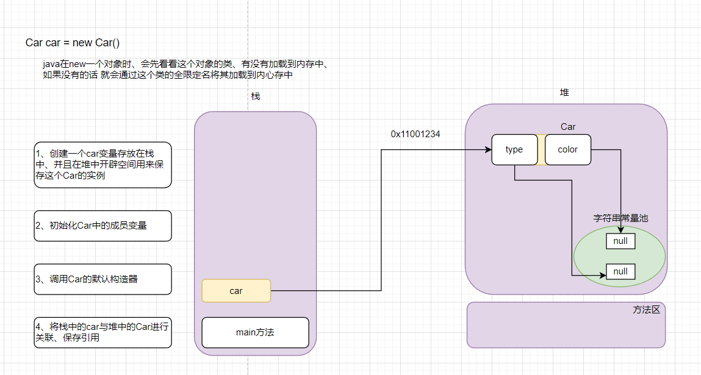

### JavaSE 摸鱼第8天...

#### 1、包的概念和命名规则

+ 为什么要有包？
  + 举个例子、在计算中存放个人文件也会按照文件类型不同分别创建文件夹来存放的，好处是：方便查找、易于管理
  + java中也是一样、可以将不同的同类型的class文件存放于不同的包下
+ 包命名规则
  + 一般采用域名倒置的写法，例如你们公司是百度`baidu.com`，那么包名就是：`com.baidu.文件名`
  + 例如我创建了一个包`com.baidu` 里面有一个文件`Main.java` 那么`com.baidu.Main` 这个路径就称之为 `Main` 文件的全限定名

#### 2、权限访问修饰符

+ 当学习了包的概念之后、再来看权限访问修饰符(学习了继承你会更加清晰)

  | 修饰符名称 | 同类 | 同包 | 子类 | 跨包 |
  | ---------- | ---- | ---- | ---- | ---- |
  | public     | ✔    | ✔    | ✔    | ✔    |
  | protected  | ✔    | ✔    | ✔    | ❌    |
  | default    | ✔    | ✔    | ❌    | ❌    |
  | private    | ✔    | ❌    | ❌    | ❌    |

  

#### 3、new关键字和构造器

##### 3.1、new关键字

+ 画个图简单分析一下 new Car() 做了什么？

  

##### 3.2、构造器

+ 事实上、在`new Car()`的时候，就会调用  Car 类的默认无参构造器(每次创建一个类、就会有一个默认的)

  ```java
  public class Car {
      // 默认送你一个
      public Car() {
      }
  }
  ```

  

+ 除了默认无参构造器、那么我们也可以写一个有参数的构造器

+ 记住、虽然会送你一个默认的无参构造器、但如果在类中写了有参构造器、但是在new 的时候不传递参数、那么 就需要手动的写出来这个无参构造器

  ```java
  public class Car {
      String type;
      String color;
  
      // 默认送你一个
      public Car() {
      }
  
      public Car(String type, String color) {
          // 给成员变量 赋值 this后面会讲到
          this.type = type;
          this.color = color;
      }
  
  
      public static void main(String[] args) {
          // 调用无参构造器
          Car car1 = new Car();
          System.out.println(car1.type); // null
          System.out.println(car1.color); // null
  
          // 调用有参构造器
          Car car2 = new Car("奔驰", "白色");
          System.out.println(car2.type); // 奔驰
          System.out.println(car2.color); // 白色
      }
  
  }
  ```

  

#### 4、this关键字

##### 4.1、this是什么? 

+  每一个方法都会默传入一个变量，这个变量叫做 `this`，this 指向调用它的(当前实例)

##### 4.2、this访问成员属性和方法

```java
package com.ilovesshan.day08.com.ilovesshan.constroctor;

public class Car {
    String type;
    String color;
    
    public Car(String type, String color) {
        this.type = type;
        this.color = color;
    }


    void printColor() {
        // this 访问成员属性
        System.out.println(this.color);
    }

    void printCar() {
        // this 访问成员方法
        this.printColor();
    }


    public static void main(String[] args) {
        Car car2 = new Car("奔驰", "白色");
        System.out.println(car2.type); // 奔驰
        System.out.println(car2.color); // 白色

        car2.printCar();
    }

}

```


##### 4.3、this访问构造器

```java
package com.ilovesshan.day08.com.ilovesshan.constroctor;

public class Car {
    String type;
    String color;

    public Car() {
        // this 访问构造器
        this("宝马", "红色");
    }

    public Car(String type, String color) {
        this.type = type;
        this.color = color;
    }

    public static void main(String[] args) {
        // 调用无参构造器
        Car car1 = new Car();
        System.out.println(car1.type); // 宝马
        System.out.println(car1.color); // 红色
    }
}

```


#### 5、getter和setter

+ 有的时候我们想对类中的成员变量进行保护、不被外部任意修改或者访问。

+ 将成员属性使用 `private` 修饰、再向外界提供 `getter`和`setter` 方法来操作和获取数据。

+ 但是调用`getter`和`setter`时、内部可以做一些处理，或者说对数据进行了一层拦截。

+ 废话不多说、上代码

  ```java
  package com.ilovesshan.day08.com.ilovesshan.entity;
  
  public class Girl {
      private int age;
  
      // 设置age
      public void setAge(int age) {
          // 逻辑处理代码
          this.age = 18;
      }
  
      // 获取age
      public int getAge() {
          // 逻辑处理代码
          return age;
      }
  
      public static void main(String[] args) {
          Girl girl = new Girl();
  
          // 设置成 30
          girl.setAge(30);
  
          // 获取是 18 是因为内部做了一层拦截
          System.out.println(girl.getAge());
      }
  }
  ```

  