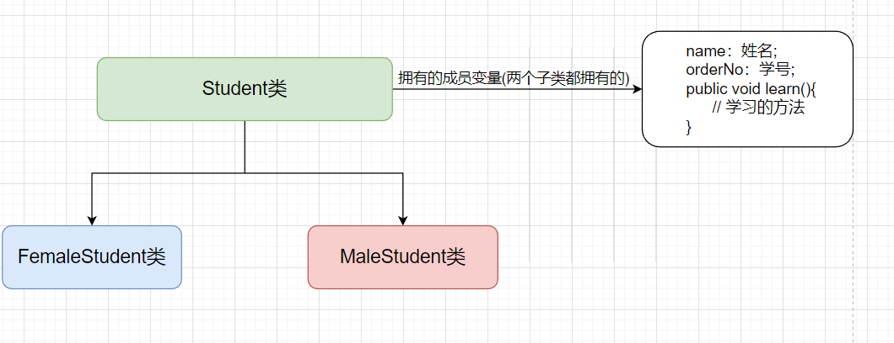
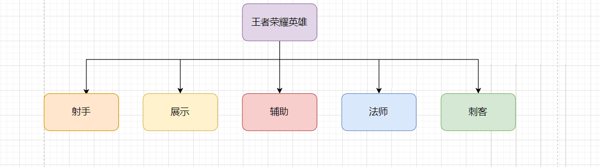

### JavaSE 摸鱼第10天...
#### 1、面向对象之继承
##### 1.1、继承是什么

+ 举个例子，你的身上某些特征肯定来自于你的父亲、那么就可以说你身上这些特征是继承了你父亲身上的特征，后面随着深入学习慢慢就了解了。

+ 需要记住：java是单继承、如果需要继承多个类，请分别继承。

+ 继承的优势：将多个类共同拥有的成员属性和成员方法抽离出来、再让这些类来继承这个抽离出来的类，提高代码复用性和可扩展。

+ 还是不太明白？我们画个图

  + 学生类

    

  + 王者荣耀-英雄

    

    

##### 1.2、子类和父类构造顺序

+ 继承某个类需要使用`extends` 关键字，例如：

  ```java
  // A类 继承B类
  
  class A extends B{
  
  }
  ```

  

+ 我们通过代码实现一下学生类的关系，以及定义成员属性、让子类来访问。

  

  + 学生类

    ```java
    public class Student {
        String name = "Student Name";
        String orderNo = "Student orderNo";
    
        public void learn() {
            System.out.println("Student learn...");
        }
    }
    ```

    

  + 男学生类

    ```java
    public class MaleStudent extends Student {
    }
    
    ```

    

  + 女学生类

    ```java
    public class FemaleStudent extends  Student {
    }
    
    ```

    

  + 测试类

    ```java
    public class Main {
        public static void main(String[] args) {
            FemaleStudent femaleStudent = new FemaleStudent();
            MaleStudent maleStudent = new MaleStudent();
    
            // 可以看出来，我们创建了学生类子类的实例，是通过子类可以访问到父类属性和方法的。
            
            System.out.println("femaleStudent.name = " + femaleStudent.name); //  Student Name
            System.out.println("maleStudent.name = " + maleStudent.name); //  Student Name
    
            femaleStudent.learn(); // Student learn...
            maleStudent.learn(); // Student learn...
    
        }
    }
    ```

  

  

+ 为啥可以访问到`Student`中的属性和方法啊? `Student`类又没有创建实例？？？

  + 事实上、父类是被创建了实例的，创建了实例的原因是：父类的默认构造法方法被调用了。

  + 代码演示：给每一个类显式的写一个默认无参构造方法

    ```java
    public class Student {
        String name = "Student Name";
        String orderNo = "Student orderNo";
    
        Student(){
            System.out.println("Student 默认无参构造器被调用...");
        }
    
        public void learn() {
            System.out.println("Student learn...");
        }
    }
    
    
    public class MaleStudent extends Student {
        MaleStudent(){
            System.out.println("MaleStudent 默认无参构造器被调用...");
        }
    }
    
    
    public class FemaleStudent extends Student {
        FemaleStudent() {
            System.out.println("FemaleStudent 默认无参构造器被调用...");
        }
    }
    ```

  +  Main方法 执行结果 

    + 可以看到是先执行了父类的构造方法，再执行子类的构造方法。

    ```java
    Student 默认无参构造器被调用...
    FemaleStudent 默认无参构造器被调用...
    Student 默认无参构造器被调用...
    MaleStudent 默认无参构造器被调用...
        
    femaleStudent.name = Student Name
    maleStudent.name = Student Name
    Student learn...
    Student learn...
    
    ```

    

  + 多个类继承时、构造器怎么执行了?

    +  A继承B，B继承C
    + new A() 之后、C的构造器被执行，紧接着B执行、最后A执行。

    

    

##### 1.3、super 关键字

+ super 关键字一般用于，子类访问父类的成员属性或者方法时使用(遵循访问修饰符)。

  ```java
  public class Car {
      String brand;
      String color;
  
      public Car() {
      }
  
      public Car(String brand, String color) {
          this.brand = brand;
          this.color = color;
      }
  
  
      public void start() {
          System.out.println("汽车启动...");
      }
  
      public void run() {
          System.out.println("汽车跑起来了...");
  
      }
      
  }
  
  ```

  

  ```java
  public class BmwCar extends Car {
  
      BmwCar() {
          // 调用父类构造器
          super("宝马", "白色");
      }
  
      public void printCarInfo() {
          // 访问父类成员属性
          System.out.println(super.brand); // 宝马
          System.out.println(super.color); // 白色
  
          // 访问父类成员方法
          super.start(); // 汽车启动...
          super.run(); // 汽车跑起来了...
      }
  }
  ```

  

  ```java
  public class CarTest {
      public static void main(String[] args) {
          BmwCar bmwCar = new BmwCar();
          bmwCar.printCarInfo();
          System.out.println("bmwCar.brand = " + bmwCar.brand); // 宝马
          System.out.println("bmwCar.color = " + bmwCar.color); // 白色
      }
  }
  ```

  

##### 1.4、super和this对比

+ `super`一般用于：子类访问父类的成员属性或者方法时使用。
+ `this`一般用于：访问当前类的成员属性或者方法时使用。

|            | this                               | super                                                |
| ---------- | ---------------------------------- | ---------------------------------------------------- |
| 访问属性   | 访问本类属性，不存在继续向上层查找 | 访问父类属性，不存在继续向上层查找                   |
| 访问方法   | 访问本类方法，不存在继续向上层查找 | 访问父类方法，不存在继续向上层查找                   |
| 访问构造器 | 访问本类构造器，只能放在第一行     | 访问父类构造器，只能放在第一行、没找到不会向上层查找 |

​	

##### 1.5、重写(Override)

+ 当子类不满意父类拥有的一些方法、这时候子类可以重写这些方法进行扩展和改写。

+ 举个列子：

  + 父类有个`eat`方法、父亲喜欢吃鱼
  + 子类可以继承父类的`eat`方法、但是我不喜欢吃鱼、我想喜欢下吃猪肉。
  + 这个时候子类就可以重写父类的`eat`方法

+ 上代码

  ```java
  public class Father {
      public void eat() {
          System.out.println("我喜欢吃鱼...");
      }
  
      public static void main(String[] args) {
          new Father().eat();  // 我喜欢吃鱼...
          new Son().eat(); // 我喜欢吃猪肉...
      }
  
  }
  
  
  class Son extends Father {
      // 重写父类 eat方法
      @Override
      public void eat() {
          System.out.println("我喜欢吃猪肉...");
      }
  }
  
  ```

##### 1.6、重写和重载

|      | 作用范围 | 方法名称 | 参数列表               | 返回值                           | 权限修饰符                     |
| ---- | -------- | -------- | ---------------------- | -------------------------------- | ------------------------------ |
| 重写 | 父子类   | 必须相同 | 必须相同               | 只能返回父类返回值类型或者子类型 | 不能缩小父类方法权限修饰符范围 |
| 重载 | 当前类   | 必须相同 | 参数类型、参数个数不同 | 无要求                           | 无要求                         |

##### 1.7、final 关键字

+ 被final修饰的类：不能被继承
+ 被final修饰的方法：不能被重写
+ 被final修饰的变量
  + 基本类型：值不能被改变
  + 引用类型：引用地址不能被改变

#### 2、Object类相关方法

##### 2.1、hash

+ `hash`是一种算法(散列算法)、输入一个随机值可以将这个随机值通过散列算法推算出一个固定长度的输出值。

+ `hash`算法特点

  + 只能通过原文计算出`hash`值、而且每次都一样、不能通过`hash`计算出原文。
  + 原文的细微变化能够引起`hash`巨大的变化。
  + 好的hash算法不应该出现`hash`相同的情况(又称`hash碰撞`)。

+ `hash`用途

  + 密码加密
  + 文件加密

+ 常见`hash`算法

  + `MD5` ：推算出128位(16字节)的散列值。

    ```java
    public class HashAlgorithm {
        public static void main(String[] args) throws NoSuchAlgorithmException {
            MessageDigest md5 = MessageDigest.getInstance("MD5");
            byte[] digest = md5.digest("ilovesshan".getBytes(StandardCharsets.UTF_8));
            System.out.println(Arrays.toString(digest));
            // [8, 3, 77, -46, -55, -95, 7, -70, -79, -52, 64, 68, 22, 127, 83, 2]
        }
    }
    ```

  + `SHA1`：推算出160位(20字节)的散列值。

  + `SHA256`推：算出256位(32字节)的散列值。

  + `SHA512`推：算出512位(64字节)的散列值。

##### 2.2、equals 

+ `equals` 用于两者之间进行比较 ，看一个案例

  ```java
  public class EqualsMethods {
      private String name;
  
  
      public static void main(String[] args) {
          String s1 = "s1";
          String s2 = "s1";
          String s3 = new String("s1");
  
          System.out.println("s1.equals(s2) = " + s1.equals(s2)); // true
          
          System.out.println("s1.equals(s2) = " + s1 == s3); // false
          
          System.out.println("s1.equals(s2) = " + s1.equals(s3)); // true
          // 很多人不理解, s3是new出来的、为啥和s1相等? equals到底比较什么?? 不妨去看看String中的equals方法具体实现
      }
  }
  ```

  + Object类的`equals`方法

    ```java
    public boolean equals(Object obj) {
        return (this == obj);
    }
    ```

    

  + String类 重写了`equals`方法

    ```java
    /**
         * Compares this string to the specified object.  The result is {@code
         * true} if and only if the argument is not {@code null} and is a {@code
         * String} object that represents the same sequence of characters as this
         * object.
         *
         * @param  anObject
         *         The object to compare this {@code String} against
         *
         * @return  {@code true} if the given object represents a {@code String}
         *          equivalent to this string, {@code false} otherwise
         *
         * @see  #compareTo(String)
         * @see  #equalsIgnoreCase(String)
         */ 
    public boolean equals(Object anObject) {
        if (this == anObject) {
            return true;
        }
        if (anObject instanceof String) {
            String anotherString = (String)anObject;
            int n = value.length;
            if (n == anotherString.value.length) {
                char v1[] = value;
                char v2[] = anotherString.value;
                int i = 0;
                while (n-- != 0) {
                    if (v1[i] != v2[i])
                        return false;
                    i++;
                }
                return true;
            }
        }
        return false;
    }
    ```

    

+ `equals` 和 `==` 区别

  + `==` 可以比较基本数据类型也可以比较引用数据类型
    + 比较基本数据类型：比较的是具体的值
    + 比较引用数据类型：比较的是引用地址
  + `equals` 只能用于比较引用类型
    + `equals`  没有被重写：底层是基于`==` 实现的、可与看`Object`源码实现
    + `equals`  被重写：就按照重写的逻辑来进行比较

+ 案例有一个`Teacher`类、拥有姓名（`name`）和工号（`orderNo`）属性

  + 创建两个`Teacher`实例、如果姓名和工号都相同就表示是一个人
  + 重写`equals`方法实

  ```java
  public class Teacher {
      String name;
      String orderNo;
  
      public Teacher(String name, String orderNo) {
          this.name = name;
          this.orderNo = orderNo;
      }
  
      @Override
      public boolean equals(Object o) {
          if (o == this) return true;
  
          if (o instanceof Teacher) {
              Teacher t = (Teacher) o;
              if (Objects.equals(t.name, this.name) && Objects.equals(t.orderNo, this.orderNo)) return true;
              return false;
          }
          return false;
  
      }
  
      public static void main(String[] args) {
          Teacher t1 = new Teacher("liLei", "111");
          Teacher t2 = new Teacher("liLei", "112");
          Teacher t3 = new Teacher("liLei", "111");
  
          System.out.println("t1.equals(t2) = " + t1.equals(t2)); // false
          System.out.println("t1.equals(t3) = " + t1.equals(t3)); // true
  
      }
  
  }
  
  ```

  

##### 2.3、toString

+ 先看一段代码、紧接着往后说

  ```java
  public class ToStringMethod {
      public static void main(String[] args) {
          // 这里借用一手 teacher 类来举例
  
          Teacher t1 = new Teacher("liLei", "1001");
          System.out.println(t1); // com.ilovesshan.day10.Teacher@e2d56bf
  
          String s1 = "1001";
          System.out.println(s1); // 1001
  
      }
  }
  
  ```

  + 啥意思啊？teacher打印出来是这个东西？？看了下面代码你就明白了！！
  + Teacher类也是Object的子类哈

  + `Object` 类中的`toString` 方法

    ```java
    public String toString() {
        //     全限定@16进制的hashCode
        return getClass().getName() + "@" + Integer.toHexString(hashCode());
    }
    ```

  + 那String为啥不打印全限定@16进制的hashCode?? 点进去源码看看

  + 原来是、String重写了Object类的toString方法

    ```java
    public String toString() {
        return this;
    }
    ```

    

##### 2.4、finalize

+ finalize 当一个类不再被使用时、JVM进行垃圾回收时会调用finalize方法。
+ 由于GC的自动回收机制，因而并不能保证finalize方法会被及时地执行（垃圾对象的回收时机具有不确定性），也不能保证它们会被执行(程序由始至终都未触发垃圾回收)。
+ jgk9之后已经废弃这个方法了。

##### 2.5、clone

+ clone方法是浅克隆、深潜克隆后面详细讲：

+ 看个小案例吧

  ```java
  //  Teacher类需要实现Cloneable接口
  public class Teacher  implements  Cloneable{
  
  }
  
  // 添加了Student成员属性 并添加getter和setter方法
  
  // Teacher类中重写了clone方法
  @Override
  protected Object clone() throws CloneNotSupportedException {
      return super.clone();
  }
  ```

  ```java
  public class ToStringMethod {
      public static void main(String[] args) throws CloneNotSupportedException {
          // 这里借用一手 teacher 类来举例
  
          Teacher t1 = new Teacher("liLei", "1001");
          System.out.println(t1); // com.ilovesshan.day10.Teacher@e2d56bf
  
          String s1 = "1001";
          System.out.println(s1); // 1001
  
  
          Teacher t2 = new Teacher("liLei", "112");
          t2.setStudent(new Student());
          Teacher t3 = (Teacher) t2.clone();
  
          t2.name = "tom";
          t2.student.name ="lucy";
  
          System.out.println(t2.name); // tom
          System.out.println(t3.name); // liLei
          System.out.println(t2.student.name); // lucy
          System.out.println(t3.student.name); // lucy
  
          System.out.println(t2.name == t3.name); // true
          System.out.println(t2.orderNo == t3.orderNo);// true
          System.out.println(t2.equals(t3)); // true
  
      }
  }
  
  ```

  