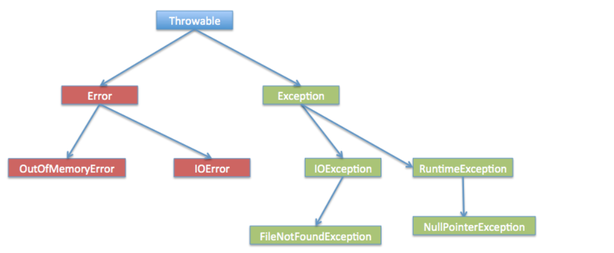
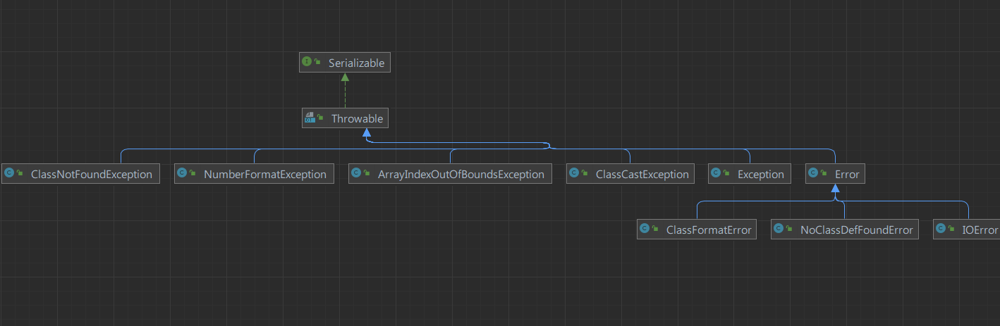

### JavaSE 摸鱼第16天...

#### 1、异常概述

##### 1.1、异常什么是

+ Java异常是Java提供的一种识别及响应错误的一致性机制。异常指的是程序在执行过程中，出现的非正常的情况，最终会导致JVM的非正常停止。
+ 如果不能处理好异常的发生，那么一旦发生异常就会导致后面的代码不执行了，整个程序就挂了！

##### 1.2、引发异常的案例

+ `ArithmeticException` 算数异常

  ```java
  int x = 0;
  int y = 10;
  int z = y / x;
  // 只是简单的举例、很有可能 x 和 y 都是外界动态传递进来的。
  System.out.println("z = " + z);
  ```

+ `ArrayIndexOutOfBoundsException` 数组下标越界异常

  ```java
  int[] ints = {1, 2, 3, 4};
  for (int i = 0; i <= ints.length; i++) {
      // 1000行代码 其他的逻辑操作 会改变i的值
      i++;
      System.out.println(ints[i]);
  }
  ```

##### 1.3、处理异常

+ 通过 手动编码、进行边界值和数据安全性判断

  ```java
  int x = 0;
  int y = 10;
  if (x != 0) {
      int z = y / x;
      System.out.println("z = " + z);
  } else {
      System.out.println("x = " + x + "不能做除数~");
  }
  ```

  ```java
  int[] ints = {1, 2, 3, 4};
  for (int i = 0; i <= ints.length; i++) {
      // 1000行代码 其他的逻辑操作 会改变i的值
      i++;
      if (i >= 0 && i < ints.length) {
          System.out.println(ints[i]);
      } else {
          System.out.println("下标越界了...");
          break;
      }
  }
  ```

  

+ 通过 java 提供的异常处理机制

  + 基本语法

    ```java
    try{
        // 可能发生异常的代码块
    }catch (Exception e) {
        // 捕获到的异常信息
        e.printStackTrace();
    }
    ```

    

  +  处理上面的异常

    ```java
    public class TryExceptionTest {
        public static void main(String[] args) {
            int x = 0;
            int y = 10;
            try {
                int z = y / x;
            } catch (Exception e) {
                System.out.println("x = " + x + "不能做除数~");
            }
    
    
            int[] ints = {1, 2, 3, 4};
            try {
                for (int i = 0; i <= ints.length; i++) {
                    // 1000行代码 其他的逻辑操作 会改变i的值
                    i++;
                    System.out.println(ints[i]);
                }
            } catch (Exception e) {
                e.printStackTrace();
                System.out.println("下标越界了...");
            }
        }
    }
    
    ```

    

#### 2、异常和错误

##### 2.1、异常体系图





##### 2.2、异常分类

+ 编译异常

  + 通俗易懂解释就是：在写代码的时候，编译器包错了、显式红色波浪线，告诉你这行代码有问题，此时处理编译阶段，所以也叫做：编译异常。

  + 常见的编译异常：

    + `IOException`                          输入输出流异常 
    + `FileNotFoundException`         文件找不到的异常 
    + `ClassNotFoundException`       类找不到异常 

    + `DataFormatException`             数据格式化异常 
    + `NoSuchFieldException`           没有匹配的属性异常 
    + `NoSuchMethodException`          没有匹配的方法异常 
    + `SQLException`                         数据库操作异常 
    + `TimeoutException`                   执行超时异常

    ```java
    public class CommonCompileException {
        public static void main(String[] args) {
    
            // FileNotFoundException 文件找不到异常
            try {
                InputStream stream = new FileInputStream(new File("/abc/text.txt"));
            } catch (FileNotFoundException e) {
                e.printStackTrace();
            }
    
            // ClassNotFoundException 类找不到异常
            try {
                Class<?> aClass = Class.forName("com.ilovesshan.day17.main");
            } catch (ClassNotFoundException e) {
                e.printStackTrace();
            }
    
            // 剩下的 后面介绍
        }
    }
    
    ```

    

+ 运行异常

  + 在编译期间通过了IDEA的检查，而在程序运行中、发生的异常就叫运行异常。
  + 常见的运行异常:
    + `ArrayIndexOutofBoundsException`     数组越界异常
    + `ClassCastException`                          类型转换异常  
    + `NullPointerException`                       空指针异常 
    + `IllegalAccessException`                    法的参数异常
    + `InputMismatchException`                    输入不匹配异常 
  + 相信 `ArrayIndexOutofBoundsException` 和  `NullPointerException` 不陌生了吧，哈哈~

##### 2.3、错误

+ 错误就是：在正常情况下程序运行中发生的错误、而导致jvm也停止运行，jvm停止运行就意味着 整个项目就挂了。

+ 常见的错误

  + 堆栈溢出  `StackOverflowError`
  + 内存不足 `OutOfMemoryError`
  + 方法不存在错误 `NoSuchMethodError`
  + 未找到类定义错误 `NoClassDefFoundError`

  ```java
  public class CommonException {
      public static void foo() {
          // 无限自己调用自己 必定造成内存溢出
          foo();
      }
  
      public static void main(String[] args) {
          CommonException.foo();
      }
  }
  
  ```

  

#### 3、自定义异常

+ 在实际的开发中针对某些业务上的逻辑、我们可能需要一些特殊的异常、那么为我们可以自定义异常来满足需求。

+ 继承 `异常` 类

  + 开发时异常继承 `Exception`
  + 运行时异常继承 `RuntimeException`

+ 做一个简单的登录案例吧

  + 如果用户名错误抛出自定义异常 `UserNameErrorException`
  + 如果密码错误抛出自定义异常 `PssswordErrorException`

  ```java
  import java.util.Scanner;
  
  public class UserLogin {
      public static void main(String[] args) {
          try {
              userLoginHandler();
          } catch (Exception e) {
              e.printStackTrace();
              // 打印异常的错误信息
              System.out.println(e.getMessage());
          }
  
      }
  
      private static void userLoginHandler() {
          Scanner scanner = new Scanner(System.in);
  
          System.out.print("请输入用户名: ");
          String username = scanner.next();
  
  
          System.out.print("请输入密码: ");
          String password = scanner.next();
  
          if (!"admin".equals(username)) {
              throw new UserNameErrorException("用户名错误");
          }
  
          if (!"123456".equals(password)) {
              throw new UserNameErrorException("密码错误");
          }
  
          System.out.println("login success~");
      }
  }
  
  
  ```

  

  ```tex
  Connected to the target VM, address: '127.0.0.1:62677', transport: 'socket'
  请输入用户名: admin
  请输入密码: 1234
  密码错误
  com.ilovesshan.day17.UserNameErrorException: 密码错误
  at com.ilovesshan.day17.UserLogin.userLoginHandler(UserLogin.java:40)
  at com.ilovesshan.day17.UserLogin.main(UserLogin.java:15)
  
  Process finished with exit code 0
  
  
  
  Connected to the target VM, address: '127.0.0.1:62677', transport: 'socket'
  请输入用户名: test
  请输入密码: 123456
  用户名错误
  com.ilovesshan.day17.UserNameErrorException: 用户名错误
  at com.ilovesshan.day17.UserLogin.userLoginHandler(UserLogin.java:36)
  at com.ilovesshan.day17.UserLogin.main(UserLogin.java:15)
  Disconnected from the target VM, address: '127.0.0.1:62677', transport: 'socket'
  
  Process finished with exit code 0
  ```

  

  

  ```java
  public class UserNameErrorException extends RuntimeException {
      private String message;
      private int code;
  
      public UserNameErrorException() {
      }
  
      public UserNameErrorException(String message) {
          this.message = message;
      }
  
      public UserNameErrorException(int code, String message) {
          super(message);
          this.code = code;
      }
  
      @Override
      public String getMessage() {
          return message;
      }
  
      public void setMessage(String message) {
          this.message = message;
      }
  
      public int getCode() {
          return code;
      }
  
      public void setCode(int code) {
          this.code = code;
      }
  }
  
  class PasswordErrorException extends RuntimeException {
      private String message;
      private int code;
  
      public PasswordErrorException() {
      }
  
      public PasswordErrorException(String message) {
          this.message = message;
      }
  
      public PasswordErrorException(int code, String message) {
          super(message);
          this.code = code;
      }
  
      @Override
      public String getMessage() {
          return message;
      }
  
      public void setMessage(String message) {
          this.message = message;
      }
  
      public int getCode() {
          return code;
      }
  
      public void setCode(int code) {
          this.code = code;
      }
  }
  
  ```

  

#### 4、抛出和捕获异常

##### 4.1、抛出异常

+ `throw`  和 `throws` 关键字

  + `throw` 是使用在：方法体中

  + `throws`  是使用在：方法签名后

+ 使用  `throws` 抛出异常可以提高代码的简洁性和阅读性、但是实际开发中不推荐。

  ```java
  public class ThrowAndThrows {
      
      // `throw` 是使用在：方法体中
      public static void t1() {
          throw new UserNameErrorException("");
      }
  
      // `throws`  是使用在：方法签名后
      public static void t2() throws UserNameErrorException {
  
      }
  }
  ```

  

##### 4.2、捕获异常

+ 通过 `throw  Exception ` 可以抛出异常，那么抛出的异常最终抛给谁？谁来解决？
  + 抛出的异常 最终会抛给 最终的调用者，那么在一层一层调用的时候也可以把异常捕获了，处理一下。
  + 抛出的异常 可以是编译异常、运行异常也可以是自定义异常，后面马上说自定义异常。

+ 上面提过 捕获异常使用 `    try { } catch (Exception e) {} ` 就ok了、

+ `catch (Exception e) {} ` 也是可以有多个的，但需要注意：越大的异常需要 越往后靠。

  ```java
  public class HandleException {
      public static void e2() throws Exception {
          // 可以把异常继续抛出去 也可以捕获
          e1();
      }
  
      public static void e1() throws Exception {
          System.out.println(10 / 0);
      }
  
      public static void main(String[] args) {
  
          // 最终的调用者 需要捕获异常了，否则就会抛给jvm 那就直接让你程序挂了
          try {
              HandleException.e2();
          } catch (Exception e) {
              System.out.println("除数不能为0~");
              e.printStackTrace();
          }
      }
  }
  
  ```


5、异常链

+ `f3` 方法中抛出了一个异常，`f2` 调用 `f3`，`f1` 又调用了 `f2`，这种情况就会产生异常链。
+ 这种情况、为了避免直接将异常抛出给客户端，需要在 `f1` 或者 `f2` 或者 `f3` 中将异常处理掉。

```java
public class ExceptionChain {

    public static void f3() {
        throw new UserNameErrorException("用户名错啦！！！");
    }

    public static void f2() {
        f3();
    }


    public static void f1() {
        f2();
    }


    public static void main(String[] args) {
        try {
            f1();
        } catch (Exception e) {
            e.printStackTrace();
            System.out.println(e.getMessage());
        }
    }
}


com.ilovesshan.day17.UserNameErrorException: 用户名错啦！！！
    at com.ilovesshan.day17.ExceptionChain.f3(ExceptionChain.java:13)
    at com.ilovesshan.day17.ExceptionChain.f2(ExceptionChain.java:17)
    at com.ilovesshan.day17.ExceptionChain.f1(ExceptionChain.java:22)
    at com.ilovesshan.day17.ExceptionChain.main(ExceptionChain.java:28)
用户名错啦！！！
```


#### 5、finally 代码块

+ `finaly` 代码块中的代码，不管 有没有发生异常都是会执行的。
+ `finaly` 代码块中 不要乱用 `return` 、`break` 、 `continue` 关键字，可能会对方法的返回值更改。 

```java
import java.util.Random;

public class FinallyCode {
    public static void main(String[] args) {
        try {
            extracted();
        } catch (Exception e) {
            e.printStackTrace();
        } finally {
            System.out.println("finally 总是会执行的");
        }
    }

    private static void extracted() {
        double aDouble = new Random().nextDouble();
        System.out.println("aDouble = " + aDouble);
        if (aDouble > 0.5) {
            throw new UserNameErrorException("用户名错误~~~");
        }
    }
}
```

```tex
aDouble = 0.041955238297828545
finally 总是会执行的


aDouble = 0.695935810231812
finally 总是会执行的
com.ilovesshan.day17.UserNameErrorException: 用户名错误~~~
at com.ilovesshan.day17.FinallyCode.extracted(FinallyCode.java:27)
at com.ilovesshan.day17.FinallyCode.main(FinallyCode.java:15)
```


6、看几道题吧

