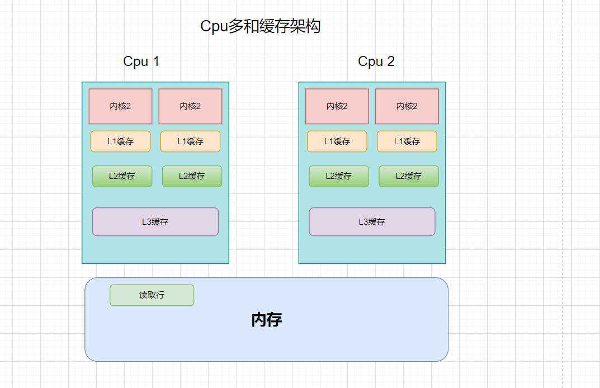

### JavaSE 摸鱼第20天...

#### 1、进程、线程、上下文切换

[关于进程、线程博客地址](!https://www.cnblogs.com/jiuxing/p/14098911.html)

##### 1.1、进程

+ 进程可以看作是程序的执行过程。一个程序的运行需要CPU时间、内存空间、文件以及I/O等资源。操作系统就是以进程为单位来分配这些资源的，所以说进程是分配资源的基本单位。
+ 进程是动态的，程序是静态的。
+ 程序与进程并不是一 一对应的关系。
  + 一个程序产生一个进程
  + 一个程序产生多个进程
  + 个程序可以被多个进程共用
  + 一个进程又可能要用到多个程序

##### 1.2、线程

+ 线程从属于进程，只能在进程的内部活动，多个线程共享进程所拥有的的资源。如果把进程看作是完成许多功能的任务的集合，那么线程就是集合中的一个任务元素，负责具体的功能。虽然CPU、内存、I/O等资源分配给了进程，但实际上真正利用这些资源并在CPU上执行的却是线程，即真正完成程序功能的是线程。

  

+ 现代很多操作系统支持让一个进程包含 多个线程，从而提高程序的并行程度和资源的利用率。

##### 1.3、上下文切换

##### 1.4、线程和进程关系

+ 一个进程可以有多个线程，但至少要有一个线程，并且一个线程只能在一个进程的地址空间内活动。
+ 资源分配给进程，而一个进程内的所有线程共享该进程的所有资源。
+ CPU分配给的是线程，即真正在CPU上运行的是线程。
+ 进程间通信较为复杂，同一台计算机的进程通信称为 IPC（Inter-	process communication）。而不同计算机之间的进程通信，则需要通过网络，并遵守共同的协议，例如 HTTP等。
+ 线程通信相对简单，因为它们共享进程内的内存，一个例子是多个线程可以访问同一个共享变量。
+ 线程更轻量，线程上下文切换成本一般上要比进程上下文切换低。

#### 2、创建线程的几种方式

##### 2.1、继承 `Thread` 类  

+ 继承 `Thread` 类、重写 `run` 方法。
+ 创建一个线程实例、并调用实例的`start`方法 ，注意是 `start`方法不是 `run`方法。

```java
class MyThread1 extends Thread {
    @Override
    public void run() {
        System.out.println("继承Thread类, 开启的子线程...");
    }
}
```

```java
public class CreateMultithreading {
    public static void main(String[] args) {
        System.out.println(1);
        
        // 创建一个线程实例、并调用 start()方法 ，注意是 start方法 不是 run方法
        new MyThread1().start();
        
        System.out.println(2);
    }
}

看执行结果：有由此可见，确实开启了一个新的线程
1
2
继承Thread类, 开启的子线程...
```


##### 2.2、实现 `Runnable`接口

+ 实现 `Runnable`接口、重写 `run` 方法。
+  注意我们创建了 一个实现Runnable接口的类的实例, 但是这个实例身上没有  start方法，那怎么开启子线程呢？
+  通过创建一个 Thread类实例, 来帮助我们创建子线程。
+ 将实现Runnable接口的类的实例作为构造参数传进去， 紧接着调用这个实例start方法就ok了。

```java
class MyThread2 implements Runnable {
    @Override
    public void run() {
        System.out.println("实现Runnable接口, 开启的子线程...");
    }
}

```

```java
public class CreateMultithreading {
    public static void main(String[] args) {

       // 注意我们创建了 一个实现Runnable接口的类的实例, 但是这个实例身上没有  start方法，那怎么开启子线程呢？
        // 通过创建一个 Thread类实例, 来帮助我们创建子线程。
        // Runnable接口的类的实例作为构造参数传进去，接着调用这个实例start方法就ok了
        
        System.out.println(1);
        MyThread2 myThread2 = new MyThread2();
        new Thread(myThread2).start();
        System.out.println(2);
    }
}

看执行结果：有由此可见，确实开启了一个新的线程
1
2
实现Runnable接口, 开启的子线程...

```

##### 2.3、创建线程的知识点补充

+ 当 `main` 方法运行时、会有一个主线程负责从上往下执行代码，遇到创建多线程时、代码并不会阻塞(特殊情况)、而是继续往下执行。

+ 主线和和创建的子线程执行先后关系：

  + 没有先后的说法、主要是看 `cpu` 来如何调度。
  + 也可以通过一些特殊办法、来将线程`挂起`、`休眠`、`让步` 等等操作、来达到想要的调用。

+ 开启线程时、注意是调用 `start` 方法、而不是 `run` 方法, 调用`run` 方法那么`jvm`就会当作调用普通方法一样处理、并不会开启多线程。

  + `Thread` 类 也是实现了 `Runnable` 接口的、

  + `Thread` 类中 有一个 `start()` 方法、这个 `start()` 方法 内部调用了 `start0()` 方法

  +  `start0()` 方法是一个本地 方法，`private native void start0();`

    

  ```java
  public class InvokeInstanceRun {
      public static void main(String[] args) {
          for (int i = 0; i < 10; i++) {
              System.out.println(Thread.currentThread().getName() + "=>" + i);
              if (i == 0) {
                  // 开启子线程
                  MyThread thread = new MyThread();
                  thread.start();
              }
          }
      }
  }
  
  class MyThread extends Thread {
      @Override
      public void run() {
          for (int i = 0; i < 10; i++) {
              System.out.println(Thread.currentThread().getName() + "=>" + i);
          }
      }
  }
  ```

  + 调用 `start` 方法得到的结果：可以看到是代码交替执行的，那么具体执行循序取决于 `CPU`

    ```java
    Connected to the target VM, address: '127.0.0.1:58939', transport: 'socket'
    main=>0
    main=>1
    main=>2
    main=>3
    main=>4
    main=>5
    main=>6
    main=>7
    Thread-0=>0
    main=>8
    main=>9
    Thread-0=>1
    Thread-0=>2
    Thread-0=>3
    Thread-0=>4
    Thread-0=>5
    Thread-0=>6
    Thread-0=>7
    Thread-0=>8
    Thread-0=>9
    Disconnected from the target VM, address: '127.0.0.1:58939', transport: 'socket'
    
    Process finished with exit code 0
    ```

    

  + 调用 `run` 方法得到的结果：可以看到是由上往下执行的，所所以 调用 `run` 并不会开启多线程。

    ```java
    Connected to the target VM, address: '127.0.0.1:58965', transport: 'socket'
    main=>0
    main=>0
    main=>1
    main=>2
    main=>3
    main=>4
    main=>5
    main=>6
    main=>7
    main=>8
    main=>9
    main=>1
    main=>2
    main=>3
    main=>4
    main=>5
    main=>6
    main=>7
    main=>8
    main=>9
    Disconnected from the target VM, address: '127.0.0.1:58965', transport: 'socket'
    ```

    

+ 通过 实现 `Runnable`接口 创建多线程时：

  + 可以通过匿名内部类和箭头函数来创建子线程、代码更加简洁。
  + `Runnable` 本身也是一个函数式接口。

  ```java
  public class CreateMultithreading {
      public static void main(String[] args) {
          // 通过匿名内部类和箭头函数来创建子线程
          new Thread(new Runnable() {
              @Override
              public void run() {
                  System.out.println("通过匿名内部类和箭头函数来创建子线程");
              }
          }).start();
      }
  }
  ```

  

#### 3、创建有返回值线程

+ 实现`Callable`接口, 并且需要实现 `call()`方法。
+ `Callable` 接口 需要传入一个泛型 这个泛型类型就是`call`方法(要返回的数据)的返回值类型。
+ 创建实现了`Callable`接口的类的实例。
+ 通过 `FutureTask` 来管理这个实例。
+ 开启线程 调用 `futureTask.run()` 。
+ `futureTask.get()` 方法获取返回值、注意 get() 方法会阻塞代码向下执行 会抛出异常。

```java
public class CreateHasReturnedThread {
    public static void main(String[] args) throws ExecutionException, InterruptedException {
        System.out.println(1);
        System.out.println(2);
        // 创建 实例
        HasReturnedThread hasReturnedThread = new HasReturnedThread();
        // 通过 FutureTask 来管理这个实例
        FutureTask<Integer> futureTask = new FutureTask<>(hasReturnedThread);
        // 开启线程
        futureTask.run();
        // 注意 get() 方法会阻塞代码向下执行 会抛出异常
        Integer value = futureTask.get();
        System.out.println(value);
        System.out.println(4);
        System.out.println(3);

    }
}

// 实现Callable接口, 并且需要实现 call()方法
// Callable 接口 需要传入一个泛型 这个泛型类型就是 all方法(你要返回的数据)的返回值类型
class HasReturnedThread implements Callable<Integer> {

    @Override
    public Integer call() throws Exception {
        return 3;
    }
}


打印结果:

Connected to the target VM, address: '127.0.0.1:59131', transport: 'socket'
1
2
3
4
3
Disconnected from the target VM, address: '127.0.0.1:59131', transport: 'socket'

Process finished with exit code 0

```


#### 4、多线程异步和效率

+ 通过单线程和多线程两种方式，来计算 `1~10000000` 的和，感受一下他们的区别。

  ```java
  package com.ilovesshan.day20;
  
  import java.util.concurrent.Callable;
  import java.util.concurrent.ExecutionException;
  import java.util.concurrent.FutureTask;
  
  public class CalculateNumberTotal {
      public static void main(String[] args) throws ExecutionException, InterruptedException {
          long total = 0;
          long maxNum = 10000000;
          
          // 单线程方式
          long startTime = System.currentTimeMillis();
  
          for (int i = 0; i < maxNum; i++) {
              total += i;
          }
          long endTime = System.currentTimeMillis();
  
          System.out.println("单线程方式   计算1~" + maxNum + "总和是: " + total + ", 耗时: " + (endTime - startTime));
  
  
          // 多线程方式
          total = 0;
          startTime = System.currentTimeMillis();
  
          FutureTask[] futureTasks = new FutureTask[10];
  
          for (int i = 0; i < futureTasks.length; i++) {
              FutureTask<Long> futureTask = new FutureTask<>(new CalculateNumber(i * 10000000, (i + 1) * 10000000));
              futureTask.run();
              futureTasks[i] = futureTask;
          }
  
          for (int i = 0; i < futureTasks.length; i++) {
              Long result = (Long) futureTasks[i].get();
              total += result;
          }
  
          endTime = System.currentTimeMillis();
          System.out.println("多线程方式   计算1~" + maxNum + "总和是: " + total + ", 耗时: " + (endTime - startTime));
      }
  }
  
  
  
  class CalculateNumber implements Callable<Long> {
      int start;
      int end;
  
      public CalculateNumber() {
      }
  
      public CalculateNumber(int start, int end) {
          this.start = start;
          this.end = end;
      }
  
      @Override
      public Long call() throws Exception {
          long result = 0L;
          for (int i = start; i < end; i++) {
              result += i;
          }
          return result;
      }
  }
  
  计算结果:    单线程比多线程快??? 哈哈哈，不知道怎么回事了~~~
      
  Connected to the target VM, address: '127.0.0.1:59554', transport: 'socket'
  单线程方式   计算1~10000000总和是: 49999995000000, 耗时: 13
  多线程方式   计算1~10000000总和是: 4999999950000000, 耗时: 80
  Disconnected from the target VM, address: '127.0.0.1:59554', transport: 'socket'
  
  Process finished with exit code 0
  
  ```
  
  

#### 5、守护线程

##### 1、守护线程  和 用户线程

+  java中线程分为两类：`守护线程`和`用户线程`

+ 守护线程(daemon thread) 又被称为 "服务进程、精灵线程、后台线程" ， 它是个服务线程，一般在后台默默的为我们提供一些服务比如：
  +  java的垃圾回收机制。
  + 敲代码时，idea提供的语法提示、语法监测等等。
+ 用户线程 用户自定义的线程。
+ 守护线程 一般会默默的为用户线程服务，在java中 任何一个守护线程都是jvm中 整个非守护线程的保姆，通俗易懂点：
  + 在`用户线程`执行完毕后，main线程就会跟着结束、`main`结束之后那么 `jvm` 也就退出来了，紧接着 `守护线程`也就结束了，
  + 如果说：用户线程还没结束的情况下，那么 `守护线程` 是不会退出的，因为：`守护线程`还需要负责回收垃圾啊~

##### 2、设置一个线程为守护线程

+ `t.setDaemon(true)` 即可设置 `t` 线程为守护线程。

```java
package com.ilovesshan.day20;

public class SetDaemonThread {
    public static void main(String[] args) {

        System.out.println("mian----");

        Thread t1 = new Thread(() -> {
            Thread t2 = new Thread(() -> {
                for (int i = 0; i < 10; i++) {
                    System.out.println("t2---" + i);
                    try {
                        Thread.sleep(100);
                    } catch (InterruptedException e) {
                        e.printStackTrace();
                    }
                }
                System.out.println("t2结束----");
            });
            // 将 t2 线程设置成 t1的守护线程, 即t1结束 那么t2 就结束
            t2.setDaemon(true);

            t2.start();

            for (int i = 0; i < 5; i++) {
                System.out.println("t1---" + i);
                try {
                    Thread.sleep(100);
                } catch (InterruptedException e) {
                    e.printStackTrace();
                }
            }
            System.out.println("t1结束----");


        });


        // 将 t1 线程设置成 main的守护线程, 即main结束 那么t1 就结束
        // t1.setDaemon(true);

        t1.start();


    }
}

```


#### 6、线程生命周期

##### 6.1、生命周期概念

+ 生命周期就好比一个人的一生，从 `出生` 到 `成人 `到 `结婚生子`  到 `晚年享福`  到 离世 的一个过程。 
+ 那么 线程也有自己的生命周期，从一个线程被创建开始 到 线程的结束，中间会经历很多种状态，那么这一系列的状态结合起来，我们就称之为 `线程的生命周期`。

##### 6.2、线程生命周期节点

+ `new`：线程被创建的初期，还没有调用 `start` 方法。

+ `runnable`：线程被调用 `start`方法之后，进入 `就绪` 状态，有可能由于某些条件导致该线程不能立即执行，原因有可能被其他线程所阻塞，也有可能该线程处于一个无限等待状态，那么具体的执行时机还是需要 `操作系统`来进行调度的。

+ `locked`：线程处于阻塞状态(一般是被动的阻塞，例如：10线程去访问一个资源，这个资源同时只允许一个线程访问，那么剩下的9个线程只能排队等，这个 `等`的状态 就是`locked`)。

+ `waiting`：处于一个无限等待状态(一般是主动的等，例如：`A线程`先执行，`A线程`执行了一会，发现需要`B线程`携带的数据，那么`A线程` 就只能等`B线程` 并且是一直等，无限的等下去，直`达B线程`到达)。

+ `timed waiting`：处于一个有限等待状态，例如我只等 5秒钟，等不到就算了，我继续执行...

+ `terminated`：线程执行完毕，退出状态。

  

##### 6.3、Thread类中的State枚举

```java
 public enum State {
        /**
         * Thread state for a thread which has not yet started.
         */
        NEW,

        /**
         * Thread state for a runnable thread.  A thread in the runnable
         * state is executing in the Java virtual machine but it may
         * be waiting for other resources from the operating system
         * such as processor.
         */
        RUNNABLE,

        /**
         * Thread state for a thread blocked waiting for a monitor lock.
         * A thread in the blocked state is waiting for a monitor lock
         * to enter a synchronized block/method or
         * reenter a synchronized block/method after calling
         * {@link Object#wait() Object.wait}.
         */
        BLOCKED,

        /**
         * Thread state for a waiting thread.
         * A thread is in the waiting state due to calling one of the
         * following methods:
         * <ul>
         *   <li>{@link Object#wait() Object.wait} with no timeout</li>
         *   <li>{@link #join() Thread.join} with no timeout</li>
         *   <li>{@link LockSupport#park() LockSupport.park}</li>
         * </ul>
         *
         * <p>A thread in the waiting state is waiting for another thread to
         * perform a particular action.
         *
         * For example, a thread that has called <tt>Object.wait()</tt>
         * on an object is waiting for another thread to call
         * <tt>Object.notify()</tt> or <tt>Object.notifyAll()</tt> on
         * that object. A thread that has called <tt>Thread.join()</tt>
         * is waiting for a specified thread to terminate.
         */
        WAITING,

        /**
         * Thread state for a waiting thread with a specified waiting time.
         * A thread is in the timed waiting state due to calling one of
         * the following methods with a specified positive waiting time:
         * <ul>
         *   <li>{@link #sleep Thread.sleep}</li>
         *   <li>{@link Object#wait(long) Object.wait} with timeout</li>
         *   <li>{@link #join(long) Thread.join} with timeout</li>
         *   <li>{@link LockSupport#parkNanos LockSupport.parkNanos}</li>
         *   <li>{@link LockSupport#parkUntil LockSupport.parkUntil}</li>
         * </ul>
         */
        TIMED_WAITING,

        /**
         * Thread state for a terminated thread.
         * The thread has completed execution.
         */
        TERMINATED;
    }
```


##### 6.4、线程生命周期执行流程图


#### 7、线程安全

##### 7.1、Cpu的多核缓存架构

+ `Cpu`缓存为了提高程序的运行性能，现代大多数`Cpu`都会对程序进行优化，`Cpu`的执行速度超级快，内存其次，硬盘最慢，在`Cpu`读取内存数据时，内存为了不拖慢`Cpu`的运行效率，为此设计出了 `Cpu的多核缓存`策略。

  


+ `Cpu` 一共设计了 三级缓存，其中 一级和二级缓存 共享同一个核中数据，三级缓存 多核共享数据。

+ `Cpu` 查找数据顺序：`L1 -> L2-> L3 -> 内存 -> 硬盘`

  

  

##### 7.2、数据局部性和缓存行

+ 在`Cpu` 读取一个数据时、并不仅仅只会读取当前所需要设个数据，而是会读取与它相邻的64个字节数据，这部分读出来的数据会放在 `缓存行`中，cpu会认为：在该数据相邻的64个字节的数据 可能立马会被`Cpu` 所使用，那么这种方式叫做 ：`数据局部性`。

+ 举个例子：

  + 下面代码中，for循环 会依次使用到使用 `num[0]`，`num[1]`，`num[2] ...`，这些数据，那么 `Cpu` 会提前考虑到 `nums[0]` 使用结束后会立即使用 `nums[1]`，这就是 `数据局部性`的体现。

  ```java
  public class CpuReadData { 
      public static void main(String[] args) {
          int[] nums = new int[10];
          for (int i = 0; i < nums.length; i++) {
              nums[i] = i;
          }
      }
  }
  ```

  

##### 7.3、数据不可见性和数据乱序性

+ `缓存行` 会引发一定的问题那就是：`数据不可见性和数据乱序性`
  + `数据不可见性` ：同一个资源 `x=0和y=0` 被存放在`缓存行` ， `Cpu1` 读取过去进行修改 `x=1, y=1`，此时 `Cpu1` 还没来得及回刷到 `缓存行`中，而  `Cpu2` 读取过去进行修改 `x=2, y=2`，此时 `Cpu2` 还没来得及回刷到 `缓存行`中，这种情况就称之为：`数据不可见性`，两个 `Cpu` 都在修改数据 而两方并不知道。
  +  `数据乱序性`：`Cpu1 和 Cpu2` 都在 修改 `x 和 y`,那么肯定会产生数据的乱序问题。
+ 对此：各个厂商 也会针对此问题提出了一些 解决办法：
  + 因特尔的 `MESI` 协议
  + `Store Buffers`
  + 内存屏障
  + `Invalidate Queues`

#### 8、java内存模型

+ java 曾经定义了一套模式，目的是：来屏蔽各种操作系统和硬件之间的差异，来实现 java程序在各种平台上都能达到一致的调用效果，这就是 `java内存模型`。
+ 然而  `java内存模型` 这带来了 一定的问题：指令重排、内存可见性、线程争抢...

##### 8.1、指令重排

+ 在指令重排是有个一经典的 `if as seiral` 语义，意思就是：单线程下，为了提高程序并行执行效率，jvm会对指令做一些排序优化，但是 不会影响到最终程序执行的结果

+ 指令优化条件：`jvm`并不会对 操作之间有依赖数据的指令进行重排，那么势必会导致结果和预期结果不一致。

+ 举个例子：

  + `指令1` 和 `指令2` 他们不依赖任何数据，所以就可以重排，谁先执行都无所谓。
  + `指令3` 是 依赖于 `指令1` 和 `指令2`的，所以不能排。 必须有 `x 和 y` 才能执行 `指令三`。

  ```java
  public class CpuReadData {
      public static void main(String[] args) {
          int x = 10; // 指令1
          int y = 10; // 指令2
          int z = x + y; // 指令3 
      }
  }
  ```

+ 在单线程下 我们不用担心指令重排带来的问题，但是在 多线程下 指令重排 也会带来一些奇怪的问题...

  + 执行两次结果：

    ```tex
    一共执行了: 184593次,消耗时间: 60733
    一共执行了: 281061次,消耗时间: 89738
    ```

    

  + 下面代码可能出现的执行循序：

    + 1、 x = 1,  y = 1,  a = 1,  b = 1
    +  2、x = 1,  y = 1,  a = 0,  b = 1
    + 3、 x = 1,  y = 1,  a = 1,  b = 0
    + 4、 x = 1,  y = 1,  a = 0,  b = 0

    

  ```java
  package com.ilovesshan.day20;
  
  /**
   * Created with IntelliJ IDEA.
   *
   * @author: ilovesshan
   * @date: 2022/7/17
   * @description: 多线程下 指令重排带来的问题
   */
  public class InstructionRearrangement {
      public static int x, y, a, b, count = 0;
  
      public static void main(String[] args) throws InterruptedException {
          long startTime = System.currentTimeMillis();
  
  
          while (true) {
              count++;
  
              Thread t1 = new Thread(() -> {
                  x = 1;
                  a = y;
              });
  
              Thread t2 = new Thread(() -> {
                  y = 1;
                  b = x;
              });
  
  
              t1.start();
              t2.start();
  
              t1.join();
              t2.join();
  
              System.out.println("x = " + x + ", y = " + y + ", a = " + a + ", b = " + b);
  
              if (a == 0 && b == 0) {
                  long endTime = System.currentTimeMillis();
                  System.out.println("一共执行了: " + count + "次," + "消耗时间: " + (endTime - startTime));
                  break;
              }
  
              x = 0;
              y = 0;
              a = 0;
              b = 0;
          }
      }
  
  }
  ```

+ 如何解决多线程下：指令重排带来的问题？

  + 添加内存屏障，java语言中通过添加 `volatile` 关键字来解决一个变量在进行读写操作时避免进行重排。
  + 内存屏障可以简单理解：在一次读写操作之前加一条指令，当cpu碰到这条指令时、必须等到前面的指令执行完才能执行后面的指令。

##### 8.2、内存可见性

+ `缓存行` 引发的问题 `数据不可见性`，看段代码：

  ```java
  package com.ilovesshan.day20;
  
  /**
   * Created with IntelliJ IDEA.
   *
   * @author: ilovesshan
   * @date: 2022/7/17
   * @description: 内存可见性
   */
  public class MemoryVisibility {
  
      // 不能够保证内存可见性
      // public static boolean flag = false;
  
      // volatile 关键字能够保证内存可见性
      public static volatile boolean flag = false;
  
      public static void main(String[] args) throws InterruptedException {
          new Thread(() -> {
              while (!flag) {
              }
              System.out.println("t1----");
          }).start();
  
          Thread.sleep(2000);
          flag = true;
      }
  }
  
  ```

+ `happens before` 语义阐述了：两个操作之间的内存可见性，如果一个操作的执行结果需要对另一个操作可见，那么这个两个操作之间需要保持 `happens before`关系。

+ 总结来说：`if as seiral` 和  `happens before`  语义一致：

  + `if as seiral` 语义可以保证：单线程下的代码 执行的结果不被改变。
  + `happens before`语义能够保证：多线程下同步代码 执行的结果不被改变。

+ `valotile` 主要作用：指令重排和内存可见性。

##### 8.3、线程争抢

+ 看一个线程争抢案例

  + 这段程序交给不懂多线程的人来看：两个for循环 分别执行了1000次 每次都对 count++； 那么count结果应该是：`2000` , 那么这么理解就错了。
  + 这里就出现了多线程争夺资源的问题，出答案可能不是 `2000`。

  ```java
  package com.ilovesshan.day20;
  
  /**
   * Created with IntelliJ IDEA.
   *
   * @author: ilovesshan
   * @date: 2022/7/17
   * @description: 线程争抢
   */
  public class ThreadFor {
  
      public static int count = 0;
  
      static void increment() {
          count++;
      }
  
      public static void main(String[] args) throws InterruptedException {
          Thread t1 = new Thread(() -> {
              for (int i = 0; i < 1000; i++) {
                  ThreadFor.increment();
              }
          });
  
  
          Thread t2 = new Thread(() -> {
              for (int i = 0; i < 1000; i++) {
                  ThreadFor.increment();
              }
          });
  
          t1.start();
          t2.start();
  
          t1.join();
          t2.join();
  
          System.out.println(count);
  
      }
  }
  ```

  + 如果需要解决种种问题，那么可以通过 `synchronized` 关键字，表示 同一时刻 只能允许一个线程来访问 这个方法，其余的线程休要排队等侯，当前这个正在访问的线程会被上锁。

  ```java
  synchronized static void increment() {
      count++;
  }
  ```

  

+ 在看一个多线程 `窗口售票的案例`

  ```java
  package com.ilovesshan.day20;
  public class Ticket implements Runnable {
      private static int count = 50;
  
      @Override
      public void run() {
          while (count > 0) {
              // 这里加锁是关键代码 具体写法后面会详细介绍到
              synchronized (Ticket.class) {
                  // Thread.currentThread().getName() 可以获取当前线程的名称   Thread-0 / Thread-1
                  String name = Thread.currentThread().getName();
  
                  System.out.println(name + "窗口卖出一张票, 剩余：" + --count + "张票~");
              }
              try {
                  Thread.sleep(100);
              } catch (InterruptedException e) {
                  e.printStackTrace();
              }
          }
      }
  
      public static void main(String[] args) {
          Thread t1 = new Thread(new Ticket());
          Thread t2 = new Thread(new Ticket());
  
          t1.start();
          t2.start();
      }
  
  }
  
  ```

  

  

#### 9、线程安全的实现方法

##### 9.1、数据不可变

+ 不可变对象一定是**线程安全**的，因为无论是方法的实现者还是调用者，都不需要采用任何的线程安全保护措施；不可变对象一经创建以后他的状态就不能被改变，对象的所有域都是[final类](https://so.csdn.net/so/search?q=final类&spm=1001.2101.3001.7020)型的。 
+ 声明不可变对象的方式有哪些？
  + final修饰成员变量
  + final修饰全局静态变量
  + final修饰局部变量
  + 使用JDK自带的Collections类声明不可变的对象 `Collections.unmodifiableMap()`
  + 使用第三方`guava`包，声明不可变对象

##### 9.2、互斥同步

+ 互斥同步是一种常见也是最主要的并发正确性保障手段，同步是指在多个线程并发访问共享数据时，保证共享数据在同一个时刻只被线程使用，JAVA里面最常见的互斥同步就是synchronized，synchronized关键字经javac编译后，会在同步块的前后形成monitorenter和monitorexit两个字节码指令。这两个字节码指令都需要一个明确的reference对象来解锁：
+ 在获取对应的reference对象后，当前线程可以操作同步代码块，若当前线程在持有锁的情况下再次获取锁，会成功，且锁的持有计数会+1，每当释放一次锁，锁的持有计数-1，当锁的持有计数为0时，锁释放，可被其他线程获取。当一个线程持有锁对象时，对于互斥同步，其他线程在获取锁对象失败后，会被阻塞。
+ 从上面的分析可以看出，互斥同步是一个重量级的操作，涉及到用户态与内核态的切换（操作互斥量和阻塞线程需要使用内核态），需要花费大量的时间，对于代码量较小的操作，应对这种重量级操作进行优化。

##### 9.3、非阻塞同步

+ 互斥同步面临的问题主要是线程阻塞和唤醒所带来的性能开销，因此这种也被称为阻塞同步。
+ 而与之对应的就是非阻塞同步。它的主要改进是对于获取锁失败的线程不再将其挂起，而是让其自旋等待一段时间，若还是无法获取锁，则挂起。
+ 设置锁的持有对象也不再需要操作互斥量，而是采用原子操作进行设置，在设置成功后，当前线程获取到锁的对象。而其他线程在原子操作获取锁失败后，会自旋（可以理解为继续走循环尝试继续获取锁）等待，直到获取锁成功，或超过一定次数后被挂起。
  

##### 9.4、无同步方案

+ 要保证线程安全，不一定非要用阻塞同步或者非阻塞同步，同步与线程安全两者没有必要的联系。如果一个方法不涉及数据共享，那么不需要任何手段就能保证其线程安全。这种无同步方案主要有两种方式实现。
+ 一是可重入代码（Reentrant Code）。它可以在运行的任何时刻中断，转而去执行另一端代码，而在控制权返回后可以继续执行，原来的程序不会出错，也不会对结果有影响。
+ 二是线程本地存储（Thread Local Storage）。如果一段代码中所需要的数据必须与其他代码共享，那么就看这些共享的数据能否保证在同一个线程中执行，如果能，则无需同步。对于每一个Thread对象，其中都有一个ThreadLocalMap对象，这个对象中，以本地线程变量的hashCode为键，本地线程变量的值为key-value键值对，因而我们可以通过这个ThreadLocalMap对象来找到对应的本地变量的值。