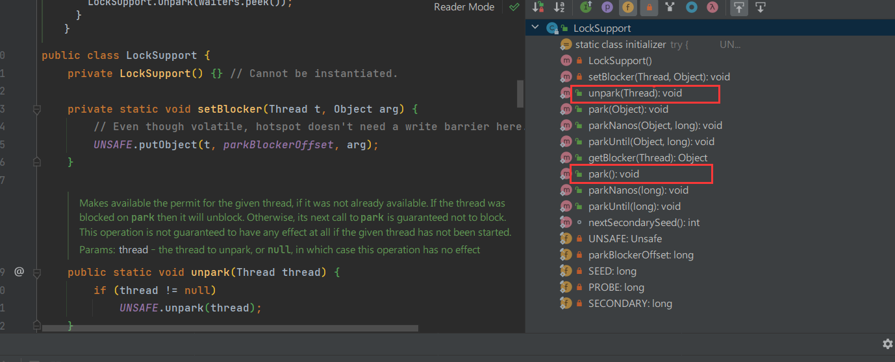

### JavaSE 摸鱼第21天...

#### 1、synchronization 使用

##### 1.1、为什么使用synchronization

+ 前面学习过java线程争抢的问题、当多个线程去抢夺同一个资源时、会发生难以预估的问题，当时我们使用了一个关键字 `synchronization` 来解决多个线程争抢同一个资源问题。
+ `synchronization` 关键字在 java中 被称为 `元老级别` 的锁，很多人认为这个锁太过于重量级了，但是在 `JDK1.6` 之后，对 `synchronizatio` 进行了优化，有自适应自旋，锁消除，锁粗化，轻量级锁，偏向锁等等，后面讲解 synchronization 锁升级过程和原理。

##### 1.2、synchronization  使用方法

+ `synchronization`  作用于方法上面

  + 1、实例方法：锁的是 `this`
  + 2、静态方法：锁的是 `当前类 class`

  ```java
  public class UseSynchronization {
  
      public synchronized void foo() {
          System.out.println("锁的是 this");
      }
  
      public synchronized static void bar() {
          System.out.println("锁的是 UseSynchronization");
      }
  
  }
  ```

  

+ `synchronization`  作用于代码块上面

  + 传递 `this` 作为 锁
  + 传递 `当前类的.class` 作为 锁
  + 传递 `任意一个对象` 作为 锁

  ```java
  public class UseSynchronization {
      public static final Object MONITOR = new Object();
  
      public void lock() {
  
          // 锁的是 this
          synchronized (this) {
              System.out.println("锁的是 this");
          }
  
          // 锁的是 UseSynchronization
          synchronized (UseSynchronization.class) {
              System.out.println("锁的是 UseSynchronization");
          }
  
          // 锁的是 UseSynchronization成员属性
          synchronized (MONITOR) {
              System.out.println("锁的是 UseSynchronization成员属性");
          }
      }
  }
  ```


##### 1.3、总结

我们使用 `synchronized` 关键字的方法有很多，可以作用与方法上或者代码块上，代码块上又能锁不同的对象。但是万变不离其宗,我们更多的是关注：多线程取访问同一个资源时， 这个锁 是否是同一把锁，只能是同一把锁才能发挥出 `synchronized` 作用，否则无效。


#### 2、synchronization 锁升级过程

##### 2.1、锁升级经历的四个阶段

+ 无锁：
  + 当只有一个线程在访问这个资源时、因为只有一个线程，所以这个资源加不加锁都无所谓。默认情况下，偏向锁是开启的。
+ 无锁到偏向锁：
  + 当线程 `A` 获取到锁时，不会修改对象头，哪怕线程 `A` 以及消亡了，之前加锁的对象头还是保持默认的对象头，这个时候线程 `B` 尝试获取锁时，首先查看 线程`A` 是否还存活，如果不存活，则将对象头清空，恢复成 无所状态再重复 `无锁到偏向锁`的过程，如果 `线程A` 还存活，但是在栈帧信息中该对象已经不需要持有该锁，那么 也会进行一次 `无锁到偏向锁`的过程。
+ 偏向锁到轻量级锁：
  + 紧接着 `无锁到偏向锁` 开始说起、如果线程 `B`尝试获取锁时、发现 线程`A` 还存活并且还持有着这把锁 ，此时线程 `B` 进行cas(乐观锁的一种实现方式)替换失败，会修改对象头，那么此时的锁就会从 `偏向锁到轻量级锁`的升级过程，此时的 线程`B` 会开启自旋模式，不断的自旋尝试去获取锁。
  + 　`java1.6`中，引入了自适应自旋锁，自适应意味着自旋 的次数不是固定不变的，而是根据前一次在同一个锁上自 旋的时间以及锁的拥有者的状态来决定。 如果在同一个锁对象上，自旋等待    刚刚成功获得过锁，并 且持有锁的线程正在运行中，那么虚拟机就会认为这次自 旋也是很有可能再次成功，进而它将允许自旋等待持续相 对更长的时间。

+ 轻量级锁到重量级锁
  + 轻量级锁替换失败次数达到一定数量是(默认10次)，就会从 `轻量级锁到重量级锁`，注意：如果在线程`B` 期间又有线程 `C`来获取锁，那么此时的轻量级锁也会膨胀成重量级锁。
  + 　关于重量级锁，其本质就是操作对象内部的监视器（monitor)

##### 2.1、锁升级标志位


##### 

#### 3、死锁、重入锁

##### 3.1、死锁

+ 线程 `A`持有 `A`资源的情况下需要获取 `B资源`，线程 `B`持有 `B`资源的情况下需要获取 `A资源`
+ 线程 `A`就等着线程 `B`释放 `B资源`，同时 线程 `B`就等着线程 `A`释放 `A资源`，这种情况下就会产生死锁。
+ 死锁是一种非常危险的行为，在开发中 我们需要避免这种情况。


```java
public class Deadlock {
    public static final Object MONITOR1 = new Object();
    public static final Object MONITOR2 = new Object();

    public static void lock1() throws InterruptedException {
        synchronized (MONITOR1) {
            Thread.sleep(1000);
            System.out.println(Thread.currentThread().getName() + "持有 MONITOR1");
            synchronized (MONITOR2) {
                System.out.println(Thread.currentThread().getName() + "持有 MONITOR2");
            }
        }
    }

    public static void lock2() throws InterruptedException {
        synchronized (MONITOR2) {
            Thread.sleep(1000);
            System.out.println(Thread.currentThread().getName() + "持有 MONITOR2");
            synchronized (MONITOR1) {
                System.out.println(Thread.currentThread().getName() + "持有 MONITOR1");
            }
        }
    }


    public static void main(String[] args) {
        new Thread(() -> {
            try {
                Deadlock.lock1();
            } catch (InterruptedException e) {
                e.printStackTrace();
            }
        }).start();


        new Thread(() -> {
            try {
                Deadlock.lock2();
            } catch (InterruptedException e) {
                e.printStackTrace();
            }
        }).start();
    }
}

打印结果：

Connected to the target VM, address: '127.0.0.1:54227', transport: 'socket'
Thread-0持有 MONITOR1
Thread-1持有 MONITOR2
   
```


##### 3.2、重入锁

https://blog.csdn.net/yanyan19880509/article/details/52345422

```java
public class RepeatLock {
    public static final Object MONITOR = new Object();

    public static void foo() {
        synchronized (MONITOR) {
            System.out.println(Thread.currentThread().getName() + "第1层");
            synchronized (MONITOR) {
                System.out.println(Thread.currentThread().getName() + "第2层");
                synchronized (MONITOR) {
                    System.out.println(Thread.currentThread().getName() + "第3层");
                }
            }
        }
    }

    public static void main(String[] args) {
        new Thread(() -> {
            RepeatLock.foo();
        }).start();
    }
}


Connected to the target VM, address: '127.0.0.1:54326', transport: 'socket'
Thread-0第1层
Thread-0第2层
Thread-0第3层
Disconnected from the target VM, address: '127.0.0.1:54326', transport: 'socket'
```


#### 4、wait和notify

wait和notify一般是成对的使用，他们是 `Object` 身上的成员方法

+ `wait` 用于将 线程挂起(无限等待)，会释放锁。`wait(time)` 用于将 线程挂起(有限等待，过了这个时间段就自己醒了)，会释放锁
+ `notify` 用于随机唤起一个线程(争夺这把锁的线程)，`notifyAll()` 用于唤醒全部线程，来争抢这把锁。、

注意：操作这个锁的原则是：你得持有这把锁才能操作它，调用 `wait 、notify 或者其他方法`，否则会报错。

```java
public class WaitAndNotify {
    public static final Object MONITOR = new Object();

    public static void main(String[] args) {

        new Thread(() -> {
            synchronized (MONITOR) {
                System.out.println(Thread.currentThread().getName() + "持有 MONITOR");
                try {
                    // 2s 自动醒
                    MONITOR.wait(2000);
                } catch (InterruptedException e) {
                    System.out.println(Thread.currentThread().getName() + "被唤醒...");
                    e.printStackTrace();
                }
                System.out.println(Thread.currentThread().getName() + "被唤醒后执行了100000行代码");
            }
        }).start();
    }
}

Connected to the target VM, address: '127.0.0.1:55300', transport: 'socket'
Thread-0持有 MONITOR
Thread-0被唤醒后执行了100000行代码
Disconnected from the target VM, address: '127.0.0.1:55300', transport: 'socket'

```

```java
public class WaitAndNotify {
    public static final Object MONITOR = new Object();

    public static void main(String[] args) {

        new Thread(() -> {
            synchronized (MONITOR) {
                System.out.println(Thread.currentThread().getName() + "持有 MONITOR");
                try {
                    // 一直睡，直到被 notify() 或者 notifyAll()
                    MONITOR.wait();
                } catch (InterruptedException e) {
                    System.out.println(Thread.currentThread().getName() + "被唤醒...");
                    e.printStackTrace();
                }
                System.out.println(Thread.currentThread().getName() + "被唤醒后执行了100000行代码");
            }
        }).start();


        new Thread(() -> {
            synchronized (MONITOR) {
                System.out.println(Thread.currentThread().getName() + "持有 MONITOR");
                try {
                    Thread.sleep(5000);
                } catch (InterruptedException e) {
                    e.printStackTrace();
                }
                MONITOR.notify();
                System.out.println(Thread.currentThread().getName() + "随机唤醒争夺MONITOR锁的一个线程");
            }
        }).start();
    }
}


Connected to the target VM, address: '127.0.0.1:55330', transport: 'socket'
Thread-0持有 MONITOR
Thread-1持有 MONITOR
Thread-1随机唤醒争夺MONITOR锁的一个线程
Thread-0被唤醒后执行了100000行代码
Disconnected from the target VM, address: '127.0.0.1:55330', transport: 'socket'

Process finished with exit code 0
    
```


#### 5、interrupt 和 线程退出

##### 5.1、interrupt 

`interrupt ` 是线程的实例方法、用来打断睡眠中的线程

+ 打断 `Thread.seleep(time)` 睡眠的线程

  ```java
  public class InterruptThread {
      public static void main(String[] args) {
  
          Runnable runnable = () -> {
              System.out.println(Thread.currentThread().getName() + "   start...");
              try {
                  Thread.sleep(6000000);
              } catch (InterruptedException e) {
                  System.out.println("被打断睡觉了...");
                  e.printStackTrace();
  
              }
              System.out.println(Thread.currentThread().getName() + "   end...");
          };
  
          Thread thread = new Thread(runnable);
          thread.start();
  
          try {
              Thread.sleep(2000);
          } catch (InterruptedException e) {
              e.printStackTrace();
          }
  
          thread.interrupt();
  
      }
  }
  
  
  
  
  Connected to the target VM, address: '127.0.0.1:51033', transport: 'socket'
  Thread-0   start...
  被打断睡觉了...
  Thread-0   end...
  java.lang.InterruptedException: sleep interrupted
  	at java.lang.Thread.sleep(Native Method)
  	at com.ilovesshan.day21.InterruptThread.lambda$main$0(InterruptThread.java:16)
  	at java.lang.Thread.run(Thread.java:748)
  Disconnected from the target VM, address: '127.0.0.1:51033', transport: 'socket'
      
  ```

  

+ 打断 `Object.wait(time)`挂起的线程

  ```java
  public class InterruptThread {
      public static final Object MONITOR = new Object();
  
      public static void main(String[] args) {
          Thread thread1 = new Thread(() -> {
              System.out.println(Thread.currentThread().getName() + "   start...");
              synchronized (MONITOR) {
                  try {
                      MONITOR.wait(6000000);
                  } catch (InterruptedException e) {
                      System.out.println("被打断睡觉了...");
                      e.printStackTrace();
  
                  }
                  System.out.println(Thread.currentThread().getName() + "   end...");
              }
          });
          thread1.start();
  
          try {
              Thread.sleep(2000);
          } catch (InterruptedException e) {
              e.printStackTrace();
          }
  
          thread1.interrupt();
  
      }
  
  }
  
  
  Connected to the target VM, address: '127.0.0.1:51113', transport: 'socket'
  Thread-1   start...
  被打断睡觉了...
  Thread-1   end...
  java.lang.InterruptedException: sleep interrupted
  	at java.lang.Thread.sleep(Native Method)
  	at com.ilovesshan.day21.InterruptThread.lambda$main$1(InterruptThread.java:36)
  	at java.lang.Thread.run(Thread.java:748)
  Disconnected from the target VM, address: '127.0.0.1:51113', transport: 'socket'
  ```

  

##### 5.2、线程退出

+ 下面代码案例中、这个线程是退不出的，`while()` 循环会一直自旋... 

+  一直自旋原因是：`while` 代码块中，并没有任何可能会影响到数据改变的代码，那么此时线程获取到的数据也就不会再次将其刷回缓存行，也就导致 `flag`一直是 `false`，即便主线程改了。

  ```java
  public class ThreadExit {
      public static boolean flag = true;
  
      public static void main(String[] args) {
          new Thread(() -> {
              while (flag) {}
              System.out.println(Thread.currentThread().getName() + "   todo...");
          }).start();
  
          try {
              Thread.sleep(3000);
          } catch (InterruptedException e) {
              e.printStackTrace();
          }
          
          flag = false;
          
      }
  }
  ```

  

+ 可以看出来下面代码中，并不是2秒中就会退出这个循环，而是2秒多才会退出。

+ 那么产生的原因是：当线程 thread把数据读取过来放到自己存数据的池子中、同时 主线程把 `flag` 改了，而 现在的 thread还在使用最开始读取的 flag，当然数据可能就不是最新的，当 thread 读取到最新的数据时这个时刻并不是主线程改 `flag` 值得时刻，可能是晚了一会。

  ```java
  public class ThreadExit {
      public static boolean flag = true;
  
      public static void main(String[] args) {
          new Thread(() -> {
              while (flag) {
                  System.out.println(Thread.currentThread().getName() + "   todo...");
              }
          }).start();
  
          try {
              Thread.sleep(3000);
          } catch (InterruptedException e) {
              e.printStackTrace();
          }
          
          flag = false;
          
      }
  }
  ```

  

+ 解决这个问题也很好办：使用 `volatile` 关键字即可。

+ `volatile` 关键字主要作用就是屏蔽了java内存模型得不可见性，当数据改变时、会强制设置其他所依赖该数据的缓存无效。

  ```java
  public static volatile boolean flag = true;
  ```

  

#### 6、lockSupport工具类 

+  `LockSupport`是`concurrent`包中一个工具类，不支持构造，提供了一堆`static`方法，主要完成相应线程的阻塞或者唤醒的工作。

+ `park()、unpark(thread)` 是比较常用的方法
  + `park()` 用于线程的阻塞工作
  + `unpark(thread)`用于线程的唤醒工作。



```java
public class ParkSupportTest {
    public static void main(String[] args) {
        Thread thread = new Thread(() -> {
            System.out.println(Thread.currentThread().getName() + "   start...");
            try {
                Thread.sleep(1000);
            } catch (InterruptedException e) {
                System.out.println("被打断睡觉了...");
                e.printStackTrace();
            }
            // 阻塞线程执行
            LockSupport.park();
            System.out.println(Thread.currentThread().getName() + "   end...");
        });

        thread.start();

        try {
            Thread.sleep(2000);
        } catch (InterruptedException e) {
            e.printStackTrace();
        }

        System.out.println(Thread.currentThread().getName() + "唤醒 thread...");
        LockSupport.unpark(thread);

    }
}


Connected to the target VM, address: '127.0.0.1:51909', transport: 'socket'
Thread-0   start...
main唤醒 thread...
Thread-0   end...
Disconnected from the target VM, address: '127.0.0.1:51909', transport: 'socket'
```


#### 7、Lock锁和读写锁

##### 7.1、Lock锁 ReentrantLock

+ `Lock`  是一个接口，我们主要研究它的实现子类 `ReentrantLock` 类，`ReentrantLock` 类主要使用到的方法是 `lock 和 unlock` 加锁和释放锁。

+ 注意：我们在加锁之后，防止代码执行出现异常导致锁不能被释放，所以通常会在 `finaly`代码块中释放锁。


+ 举个例子，通过 ``ReentrantLock` 类` 来实现多线程窗口售票问题。

  ```java
  package com.ilovesshan.day21;
  
  import java.util.concurrent.locks.Lock;
  import java.util.concurrent.locks.ReentrantLock;
  
  
  public class ReentrantLockTicket {
      public  static  final Lock reentrantLock = new ReentrantLock();
  
      public static int count = 100;
  
      public synchronized static void sale() {
          // 加锁
          reentrantLock.lock();
          
          try {
              while (count > 0) {
                  try {
                      Thread.sleep(20);
                  } catch (InterruptedException e) {
                      e.printStackTrace();
                  }
                  System.out.println(Thread.currentThread().getName() + "窗口卖票一张, 剩余: " + --count);
              }
          } catch (Exception e) {
              e.printStackTrace();
          } finally {
              // 无论如何 都要保证释放锁
              reentrantLock.unlock();
          }
      }
  
      public static void main(String[] args) {
          new Thread(ReentrantLockTicket::sale, "窗口1").start();
          new Thread(ReentrantLockTicket::sale, "窗口1").start();
          new Thread(ReentrantLockTicket::sale, "窗口1").start();
      }
  }
  ```

  

##### 7.2、读写锁 ReentrantReadWriteLock

`ReentrantReadWriteLock` 读写锁实现了 `ReadWriteLock` 接口， `ReadWriteLock` 接口有两个抽象方法 `readLock` 和  `writeLock`。


`ReentrantReadWriteLock` 本质会分成两把锁，一把读数据， 一把写数据，当在读数据的时候可允许多个线程一起来读，但是写的时候只允许一个线程写，这个时候不能读。

在真是开发中、读的并发量远远大于写，无非这也是一个好的优化手段，比起 `synchronization` 关键字来说(每次都要加锁)

使用 `ReentrantReadWriteLock` 举个例子：

```java
package com.ilovesshan.day21;

import java.util.concurrent.locks.ReentrantReadWriteLock;

public class ReentrantReadWriteLockTest {

    public static ReentrantReadWriteLock sReadWriteLock = new ReentrantReadWriteLock();
    public static int count = 1;


    public static void read() {
        // 获取 读取锁
        ReentrantReadWriteLock.ReadLock readLock = sReadWriteLock.readLock();
        readLock.lock();
        try {
            Thread.sleep(100);
            System.out.println(Thread.currentThread().getName() + "读取数据...");
        } catch (Exception e) {
            e.printStackTrace();
        } finally {
            readLock.unlock();
        }
    }

    public static void write() {
        // 获取 写入锁
        ReentrantReadWriteLock.WriteLock writeLock = sReadWriteLock.writeLock();
        writeLock.lock();
        try {
            Thread.sleep(100);
            System.out.println(Thread.currentThread().getName() + "写入数据...");
        } catch (Exception e) {
            e.printStackTrace();
        } finally {
            writeLock.unlock();
        }
    }


    public static void main(String[] args) {
        for (int i = 0; i < 100; i++) {
            int num = (int) (Math.random() * 100);
            if (num > 20) {
                // 读
                new Thread(() -> ReentrantReadWriteLockTest.read()).start();
            } else {
                // 写
                new Thread(() -> ReentrantReadWriteLockTest.write()).start();
            }
        }
    }
}
```


#### 8、线程方法总结

+ Thread 实例
  + join()
  + setDaemon()
  + interrupt()
  + setPriority()
+ Thread 静态方法
  + Thread.sleep()
  + Thread.yield()
+ `Object`
  + wait()
  + notify()