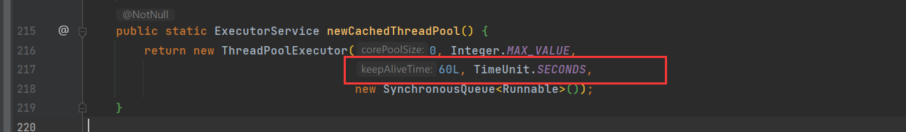
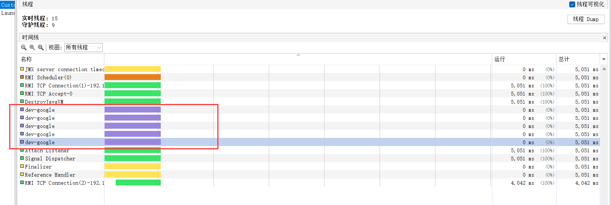

### JavaSE 摸鱼第22天...

#### 1、并发编程的三大特征

##### 1.1、原子性

将一个或者多个操作视为一个整体，要么不执行，要么全部执行完毕，在执行的中途不能被其他线程的调度机制所打断，而这种操作一旦开始就必须执行结束，中间不会有任何的上下文切换。

##### 1.2、可见性

在java的内存模型章节有了解到：缓存行数据引发的数据可见性，而解决可见性问题可以通过添加关键字 `volatile` 。

##### 1.3、有序性

在java的内存模型章节也有了解到：有序性(就是指令重排的问题)，通过添加内存屏障(添加关键字 `volatile` )来解决读写时指令重排。

内存屏障可以简单理解：在一次读写操作之前加一条指令，当cpu碰到这条指令时、必须等到前面的指令执行完才能执行后面的指令。

##### 1.4、synchronization和volatile 区别

`synchronization` 关键字：可以保证：原子性、可见性、有序性。

`volatile` 关键字：只能保证：可见性、有序性，不能保证原子性。


#### 2、 证明volatile不具备原子性

+ 下面这段代码，貌似每次执行的结果都是 `500`，这也许只是碰巧，因为线程执行的速度很快，并没有造成堵塞。

  ```java
  public class VolatileTest {
      private static volatile int count = 0;
  
      public static void main(String[] args) throws InterruptedException {
          for (int i = 0; i < 500; i++) {
              // 创建500个线程 每次进行count+1
              new Thread(() -> count++).start();
          }
  
          // 睡2s 查看结果
          Thread.sleep(2000);
  
          System.out.println("count= " + count);
  
      }
  }
  
  
  
  Connected to the target VM, address: '127.0.0.1:52966', transport: 'socket'
  count= 500
  Disconnected from the target VM, address: '127.0.0.1:52966', transport: 'socket'
  
  Process finished with exit code 0
  ```

  

+ 下面我们将代码改造一下，线程创建完成后，不立马改变 `count`，睡10毫秒再改变。

+ 可以看到最终的 `count` 并不是500，貌似加了 `volatile` 关键字也没有保证到原子性。

+ 主要产生的原因是：每个线程都会睡10毫秒，这个睡的过程并不是每个线程排队睡，而是创建了的线程一起睡，10ms之后，大量线程会并发的去修改这个count，但是就是这一瞬间 并不能保证谁先获取谁先修改count再刷回缓存里面。

  ```java
  public class VolatileTest {
      private static volatile int count = 0;
  
      public static void main(String[] args) throws InterruptedException {
          for (int i = 0; i < 500; i++) {
              // 创建500个线程 每次进行count+1
              new Thread(() -> {
                  try {
                      Thread.sleep(10);
                      count++;
                  } catch (InterruptedException e) {
                      e.printStackTrace();
                  }
              }).start();
          }
  
          // 睡2s 查看结果
          Thread.sleep(2000);
  
          System.out.println("count= " + count);
  
      }
  }
  
  
  Connected to the target VM, address: '127.0.0.1:52999', transport: 'socket'
  count= 488
  Disconnected from the target VM, address: '127.0.0.1:52999', transport: 'socket'
  
  Process finished with exit code 0
  
  ```

  


#### 3、 Lock锁原理-cas和aqs

上一章节中我们了解过 `Lock`接口的一个实现子类 `ReentrantLock(可重入锁)`,里面主要有两个常用的方法 `lock` 和 `unlock`，控制线挂起和唤醒操作。而 `ReentrantLock` 类主要也是通过 `cas` 和 `aqs` 来实现的。

##### 3.1、CAS  (Compare-and-swap) 

+ `CAS`也叫乐观锁，是一种在多线程环境下实现数据同步的机制，`CAS` 主要包含三个信息，`数据内存地址、期望值、新值`。

+ 主要实现的原理就是：每次准备更新数据到缓存时，先通过数据内存地址读取的数据和 期望值比较是否相同，相同则更新，不相同也就意味着 数据内存地址指向的数据已经发生变化了，暂时不更新，然后会通过不断尝试去比较和更新，总有一次会更新成功的。

+ `CAS` 会产生 `A B A`的问题，比如：

  

+ 防止 ABA问题就是通过 加一个 版本号来区别，每做一次修改就会加一次版本号，而其他线程再修改数据的时候也会进行版本号的比较。

##### 3.2、AQS

https://blog.csdn.net/mulinsen77/article/details/84583716

+ `AQS (AbstractQueuedSynchronizer)` 抽象队列同步器，是java提供的 `Synchonization`关键字之外的一套锁机制。

+ `AQS` 核心思想就是：如果被请求的资源空间空闲，就将该请求资源的线程设置为有效工作线程，并且将就将该请求资源设置为锁定状态，如果被请求的资源空间被占用，那么这个时候就需要有一套能够处理线程的阻塞等待和唤醒分配的锁机制，`AQS`底层就维护了这样一个队列 `CLH`，将未分配到资源的线程放入 `CLH`队列中排队等候。 

+ `AQS`是将每一条请求共享资源的线程封装成一个`CLH`锁队列的一个结点（Node），来实现锁的分配。

+ `AQS`就是基于`CLH`队列，用volatile修饰共享变量state，线程通过`CAS`去改变状态符，成功则获取锁成功，失败则进入等待队列，等待被唤醒。

  

#### 4、公平锁和非公平锁区别

##### 4.1、分析一下 `ReentrantLock`类结构

在构造 `ReentrantLock` 时、可以通过传入一个 `fair` 关键字来告诉 `ReentrantLock` 创建`公平锁(fairSync)`还是`非公平锁(NonfairSync)`,默认创建 非公平锁。


		

​		


##### 4.2、公平锁和非公平锁区别区别

+ 公平锁：比较本分，所有线程会进入到队列中排队，永远是队列第一个才能获得锁。

  + 优点：每一个线程都能获得资源，不会出现线程饿死。

  + 缺点：吞吐量比较低，线程的阻塞和唤醒对于`CPU`的性能开销比较大，一次线程的唤醒和阻塞需要一次 用户态和内核态的切换。

    

+ 非公平锁：多个线程去获取锁的时候，每一次都会尝试去抢一次锁，如果没抢到就乖乖进入到 `CLH` 队列中等，如果抢到了就能获取锁。

  + 优点：吞吐量高、线程不需要阻塞和唤醒对于 `CPU`性能消耗不高
  + 缺点：处于队列中后和末尾的位置的线程，由于长时间获取不到锁可能会导致饿死。


#### 5、lock和tryLock区别

+ `lock` 获取锁是走的是：公平锁的机制，若有可用锁，则获取该锁并返回true，否则返回false，不会有延迟或等待；

  

+ `tryLock`获取锁是走的是：非公平锁的机制，`tryLock(long timeout, TimeUnit unit)`可以增加时间限制，如果超过了指定的时间还没获得锁，则返回 false。若有可用锁，则获取该锁并返回true，否则会一直等待直到获取可用锁。

  

#### 6、原子类

`java` 提供的在多线程环境下，能够保证原子性的类。

##### 6.1、基本原子类

`AtomicInteger、AtomicLong、AtomicBoolean`

```java
import java.util.concurrent.atomic.AtomicInteger;

public class AtomicIntegerTest {
    static AtomicInteger mAtomicInteger = new AtomicInteger(0);

    public static void add() {
        mAtomicInteger.set(mAtomicInteger.get() + 1);
    }

    public static void main(String[] args) throws InterruptedException {
        for (int i = 0; i < 10; i++) {
            new Thread(AtomicIntegerTest::add).start();
            new Thread(AtomicIntegerTest::add).start();
            new Thread(AtomicIntegerTest::add).start();
        }


        Thread.sleep(3000);

        System.out.println("mAtomicInteger.get() = " + mAtomicInteger.get());
    }
}


Connected to the target VM, address: '127.0.0.1:50502', transport: 'socket'
mAtomicInteger.get() = 30
Disconnected from the target VM, address: '127.0.0.1:50502', transport: 'socket'

Process finished with exit code 0
```


##### 6.2、数组类型原子类

`AtomicIntegerArray、AtomicLongArray、AtomicReferenceArray`

##### 6.3、引用类型原子类

`AtomicReference、AtomicStampedReference、AtomicMarkableReference`

##### 6.4、升级类型原子类

`AtomicIntegerfieldupdater、AtomicLongFieldUpdater、AtomicReferenceFieldUpdater`

##### 6.5、累加器

`LongAdder、DoubleAdder`

##### 6.6、积累器

`LongAccumulator、DoubleAccumulator`


#### 7、线程池

##### 7.1、java四大线程池

这四个线程池都有共同的方法：

+ 通过 `service.submit(Runnable r) ` 来提交任务
+ 通过 `service.shutdown()` 结束任务(会等任务全部执行完毕)
+ 通过 `service.shutdownNow()` 立即结束任务

`Executors.newFixedThreadPool()` : 创建一个定长线程池，可控制线程最大并发数，超出的线程会在队列中等待。

+ 可以看到结果是：每5个一组打印的，因为线程池中的线程只有 5个，最多同时只能5个一起执行任务

  ```java
  import java.util.concurrent.ExecutorService;
  import java.util.concurrent.Executors;
  
  /**
   * Created with IntelliJ IDEA.
   *
   * @author: ilovesshan
   * @date: 2022/7/24
   * @description: 创建一个定长线程池，可控制线程最大并发数，超出的线程会在队列中等待。
   */
  
  public class FixedThreadPoolTest {
      public static void main(String[] args) throws InterruptedException {
          ExecutorService service = Executors.newFixedThreadPool(5);
  
          for (int i = 0; i < 100; i++) {
              int finalI = i;
              service.submit(() -> {
                  try {
                      Thread.sleep(2000);
                      System.out.println("********" + finalI + "*********");
                  } catch (InterruptedException e) {
                      e.printStackTrace();
                  }
              });
          }
      }
  }
  
  ```

  

`Executors.newScheduledThreadPool()`:创建一个可定期或者延时执行任务的定长线程池，支持定时及周期性任务执行。

+ 该线程池的线程如果都处于空天状态了，如果想立即就销毁掉(main方法退出)，需要调用一下 `shutdown` 方法。

  ```java
  package com.ilovesshan.day22;
  
  import java.util.concurrent.Executors;
  import java.util.concurrent.ScheduledExecutorService;
  
  /**
   * Created with IntelliJ IDEA.
   *
   * @author: ilovesshan
   * @date: 2022/7/24
   * @description: 创建一个可定期或者延时执行任务的定长线程池，支持定时及周期性任务执行。
   */
  
  public class ScheduledThreadPoolTest {
  
      public static void main(String[] args) {
          ScheduledExecutorService service = Executors.newScheduledThreadPool(10);
          for (int i = 0; i < 50; i++) {
              int finalI = i;
              service.submit(() -> {
                  try {
                      Thread.sleep(2000);
                      System.out.println("********" + finalI + "*********");
                  } catch (InterruptedException e) {
                      e.printStackTrace();
                  }
              });
          }
  
          service.shutdown();
      }
  }
  
  ```

  

`Executors.newCachedThreadPool()`:创建一个可缓存线程池，如果线程池长度超过处理需要，可灵活回收空闲线程，若无可回收，则新建线程。 

+ 需要多少线程就创建多少线程放到线程池中去做事情，做完之后，一段时间(一分钟)没任务就自动回收了。

  

  ```java
  package com.ilovesshan.day22.pool;
  
  import java.util.concurrent.ExecutorService;
  import java.util.concurrent.Executors;
  
  /**
   * Created with IntelliJ IDEA.
   *
   * @author: ilovesshan
   * @date: 2022/7/24
   * @description: 创建一个可缓存线程池，如果线程池长度超过处理需要，可灵活回收空闲线程，若无可回收，则新建线程。 
   */
  
  public class CachedThreadPoolTest {
  
      public static void main(String[] args) {
          ExecutorService service = Executors.newCachedThreadPool();
          for (int i = 0; i < 50; i++) {
              int finalI = i;
              service.submit(() -> {
                  try {
                      Thread.sleep(2000);
                      System.out.println("********" + finalI + "*********");
                  } catch (InterruptedException e) {
                      e.printStackTrace();
                  }
              });
          }
      }
  }
  
  ```

  


`Executors.newSingleThreadScheduledExecutor()`:创建一个单线程化的线程池，它只会用唯一的工作线程来执行任务，保证所有任务按照指定顺序(FIFO, LIFO, 优先级)执行。

+ 一次只能执行一个任务，线程池中只有一个线程

  

  

  ```java
  package com.ilovesshan.day22.pool;
  
  import java.util.concurrent.ExecutorService;
  import java.util.concurrent.Executors;
  
  /**
   * Created with IntelliJ IDEA.
   *
   * @author: ilovesshan
   * @date: 2022/7/24
   * @description: 创建一个单线程化的线程池，它只会用唯一的工作线程来执行任务，保证所有任务按照指定顺序(FIFO, LIFO, 优先级)执行。
   */
  
  public class SingleThreadScheduledExecutorTest {
  
      public static void main(String[] args) {
          ExecutorService service = Executors.newSingleThreadExecutor();
          for (int i = 0; i < 50; i++) {
              int finalI = i;
              service.submit(() -> {
                  try {
                      Thread.sleep(2000);
                      System.out.println("********" + finalI + "*********");
                  } catch (InterruptedException e) {
                      e.printStackTrace();
                  }
              });
          }
      }
  }
  
  ```


##### 7.2、线程池源码分析

上诉四个线程池在进行构造的时候，都会调用 `ThreadPoolExecutor` 的构造方法。

+ 调用 `ThreadPoolExecutor` 构造器

  

  

  

  

  

  

+ `Executors.newScheduledThreadPool()`  间接性的调用 `ThreadPoolExecutor` 构造器

  

+ `ThreadPoolExecutor` 构造器参数：

  1、`corePoolSize` ： 线程池中线程数量

  

  2、`maximumPoolSize`：线程池中线程最大数量

  

  3、`keepAliveTime`：线程在无任务状态下，经过 `n`段时间后会被自动会收。

  

  4、`TimeUnit`：时间单位，同于描述 `keepAliveTime` 。

  

  5、`BlockingQueue<Runnable> workQueue` ：暂时未被线程执行的任务存放的队列

  

  6、`ThreadFactory threadFactory`：线程工厂， `ThreadFactory` 是一个接口，里面有一个抽象方法 :`Thread newThread(Runnable r)`

   

  7、`RejectedExecutionHandler handler`:拒绝策略，当线程池数量达到一定量之后，线程队列数量也放不下了，部分的任务会被拒绝。`RejectedExecutionHandler ` 是一个接口，里面有一个抽象方法 :`void rejectedExecution(Runnable r, ThreadPoolExecutor executor)void rejectedExecution(Runnable r, ThreadPoolExecutor executor)` 

  

  ```java
  	/**
       * Creates a new {@code ThreadPoolExecutor} with the given initial
       * parameters.
       *
       * @param corePoolSize the number of threads to keep in the pool, even
       *        if they are idle, unless {@code allowCoreThreadTimeOut} is set
       * @param maximumPoolSize the maximum number of threads to allow in the
       *        pool
       * @param keepAliveTime when the number of threads is greater than
       *        the core, this is the maximum time that excess idle threads
       *        will wait for new tasks before terminating.
       * @param unit the time unit for the {@code keepAliveTime} argument
       * @param workQueue the queue to use for holding tasks before they are
       *        executed.  This queue will hold only the {@code Runnable}
       *        tasks submitted by the {@code execute} method.
       * @param threadFactory the factory to use when the executor
       *        creates a new thread
       * @param handler the handler to use when execution is blocked
       *        because the thread bounds and queue capacities are reached
       * @throws IllegalArgumentException if one of the following holds:<br>
       *         {@code corePoolSize < 0}<br>
       *         {@code keepAliveTime < 0}<br>
       *         {@code maximumPoolSize <= 0}<br>
       *         {@code maximumPoolSize < corePoolSize}
       * @throws NullPointerException if {@code workQueue}
       *         or {@code threadFactory} or {@code handler} is null
       */
  
  public ThreadPoolExecutor(int corePoolSize,
                            int maximumPoolSize,
                            long keepAliveTime,
                            TimeUnit unit,
                            BlockingQueue<Runnable> workQueue,
                            ThreadFactory threadFactory,
                            RejectedExecutionHandler handler) {
      if (corePoolSize < 0 ||
          maximumPoolSize <= 0 ||
          maximumPoolSize < corePoolSize ||
          keepAliveTime < 0)
          throw new IllegalArgumentException();
      if (workQueue == null || threadFactory == null || handler == null)
          throw new NullPointerException();
      this.acc = System.getSecurityManager() == null ?
          null :
      AccessController.getContext();
      this.corePoolSize = corePoolSize;
      this.maximumPoolSize = maximumPoolSize;
      this.workQueue = workQueue;
      this.keepAliveTime = unit.toNanos(keepAliveTime);
      this.threadFactory = threadFactory;
      this.handler = handler;
  }
  ```


##### 7.3、自定义线程池

可以仿照jdk中原生的线程池来创建自定义线程池

```java
package com.ilovesshan.day22.pool;

import java.util.concurrent.*;

/**
 * Created with IntelliJ IDEA.
 *
 * @author: ilovesshan
 * @date: 2022/7/24
 * @description: 自定义线程池
 */
public class CustomThreadPool {

    public static void main(String[] args) {
        ThreadPool threadPool = new ThreadPool(
            5,
            10,
            0,
            TimeUnit.MINUTES,
            // 10 队列只能放10个任务 多余的会被拒绝掉
            new LinkedBlockingQueue<Runnable>(10),
            new MyThreadFactory(),
            new MyRejectedExecutionHandler()
        );

        for (int i = 0; i < 25; i++) {
            int finalI = i;
            Thread thread = new Thread(() -> {
                try {
                    System.out.println("*************" + finalI + "*******************");
                    Thread.sleep(100);
                } catch (InterruptedException e) {
                    e.printStackTrace();
                }
            });

            threadPool.submit(thread);
        }

        threadPool.shutdown();
    }

}


class ThreadPool extends ThreadPoolExecutor {
    public ThreadPool(int corePoolSize, int maximumPoolSize, long keepAliveTime, TimeUnit unit, BlockingQueue<Runnable> workQueue, ThreadFactory threadFactory, RejectedExecutionHandler handler) {
        super(corePoolSize, maximumPoolSize, keepAliveTime, unit, workQueue, threadFactory, handler);
    }
}


// 自定义线程工厂
class MyThreadFactory implements ThreadFactory {

    @Override
    public Thread newThread(Runnable r) {
        return new Thread(r);
    }
}


// 自定义拒绝策略
class MyRejectedExecutionHandler implements RejectedExecutionHandler {

    @Override
    public void rejectedExecution(Runnable r, ThreadPoolExecutor executor) {
        // 在这里为 被拒绝的任务做一些补偿
        System.out.println("任务太多了,做不完....");
    }
}


Connected to the target VM, address: '127.0.0.1:52114', transport: 'socket'
*************2*******************
*************4*******************
*************3*******************
*************1*******************
*************0*******************
*************16*******************
*************15*******************
*************17*******************
*************18*******************
任务太多了,做不完....
任务太多了,做不完....
任务太多了,做不完....
任务太多了,做不完....
任务太多了,做不完....
*************19*******************
*************5*******************
*************7*******************
*************6*******************
*************10*******************
*************8*******************
*************9*******************
*************11*******************
*************12*******************
*************13*******************
*************14*******************
Disconnected from the target VM, address: '127.0.0.1:52114', transport: 'socket'

Process finished with exit code 0
```


#### 8、线程工厂

在JDK的源码使用工厂模式，ThreadFactory就是其中一种。

设想这样一种场景，我们需要一个线程池，并且对于线程池中的线程对象，赋予统一的线程优先级、统一的名称、甚至进行统一的业务处理或和业务方面的初始化工作，这时工厂方法就是最好用的方法了。

##### 8.1、分析 `DefaultThreadFactory` 源码

```java
static class DefaultThreadFactory implements ThreadFactory {
        private static final AtomicInteger poolNumber = new AtomicInteger(1);
        private final ThreadGroup group;
        private final AtomicInteger threadNumber = new AtomicInteger(1);
        private final String namePrefix;

        DefaultThreadFactory() {
            SecurityManager s = System.getSecurityManager();
            group = (s != null) ? s.getThreadGroup() :
                                  Thread.currentThread().getThreadGroup();
            namePrefix = "pool-" +
                          poolNumber.getAndIncrement() +
                         "-thread-";
        }

        public Thread newThread(Runnable r) {
            Thread t = new Thread(group, r,
                                  namePrefix + threadNumber.getAndIncrement(),
                                  0);
            if (t.isDaemon())
                t.setDaemon(false);
            if (t.getPriority() != Thread.NORM_PRIORITY)
                t.setPriority(Thread.NORM_PRIORITY);
            return t;
        }
    }
```

##### 8.2、自定义线程工厂

```java
// 自定义线程工厂
class MyThreadFactory implements ThreadFactory {
    private static final AtomicInteger poolNumber = new AtomicInteger(1);
    private final String namePrefix;

    // 自己定义线程的名字 方便排查
    MyThreadFactory(String prefix) {
        namePrefix = "pool-" + prefix + poolNumber.getAndIncrement();
    }

    public Thread newThread(Runnable r) {
        Thread t = new Thread(null, r, namePrefix, 0);
        if (t.isDaemon())
            t.setDaemon(false);
        if (t.getPriority() != Thread.NORM_PRIORITY)
            t.setPriority(Thread.NORM_PRIORITY);
        return t;
    }

}
```


可以通过 Jdk的工具 `E:\workspace\env\jdk1.8.0_181\bin\jvisualvm.exe` 进行线程监视


##### 8.3、第三方线程工厂工具

我们自定义的线程仅仅就是更改了线程名字而已，还有其他的特殊特殊情况需要考虑，为此 `Goole` 和 `apache ` 都提供了一个线程工厂工具类，方便我们自定义线程的名字。

+ google 提供的 ThreadFactory  【https://repo1.maven.org/maven2/com/google/guava/guava/30.1.1-jre/】
+ apache 提供的BasicThreadFactory  【https://repo1.maven.org/maven2/org/apache/commons/commons-lang3/3.12.0/】

```java
// google 提供的线程工厂
ThreadFactory factory = new ThreadFactoryBuilder().setNameFormat("dev-google").build();

// apache 提供的线程工厂
BasicThreadFactory factory = new BasicThreadFactory.Builder().namingPattern("dev-apache").build();
```





#### 9、线程同步工具

+ 倒计时器、循环栅栏 他们主要运用的场景：一共有 A，B，C三个线程，但是主线程需要等 这三个线程执行完毕再执行，也就是多个线程同步的问题。在前面的学习过程中、可以通过调用 线程实例的`join` 方法来实现这种需求。下面我们通过倒计时器和循环栅栏优雅的来实现这个需求。

  ```java
  public class ThreadSync {
      static void todo() {
          System.out.println(Thread.currentThread().getName() + " 开始执行...");
          try {
              Thread.sleep((new Random().nextInt(5000)));
          } catch (InterruptedException e) {
              e.printStackTrace();
          }
          System.out.println(Thread.currentThread().getName() + " 执行结束...");
      }
  }
  ```

  

  ```java
  package com.ilovesshan.day22.threadSync;
  
  import java.util.Random;
  
  /**
   * Created with IntelliJ IDEA.
   *
   * @author: ilovesshan
   * @date: 2022/7/24
   * @description:
   */
  class JoinText {
      
      public static void main(String[] args) throws InterruptedException {
          // task 1
          Thread t1 = new Thread(ThreadSync::todo, "A线程");
          t1.start();
          t1.join();
  
  
          // task 2
          Thread t2 = new Thread(ThreadSync::todo, "B线程");
          t2.start();
          t2.join();
  
  
          // task 3
          Thread t3 = new Thread(ThreadSync::todo, "C线程");
          t3.start();
          t3.join();
  
          System.out.println("主线程开始工作了...");
      }
  }
  
  
  Connected to the target VM, address: '127.0.0.1:54117', transport: 'socket'
  A线程 开始执行...
  A线程 执行结束...
  B线程 开始执行...
  B线程 执行结束...
  C线程 开始执行...
  C线程 执行结束...
  主线程开始工作了...
  Disconnected from the target VM, address: '127.0.0.1:54117', transport: 'socket'
  
  Process finished with exit code 0
  ```

  

#####  9.1、倒计时器

```java
import java.util.concurrent.ExecutorService;

class CountDownTest {

    public static void main(String[] args) throws InterruptedException {

        CountDownLatch downLatch = new CountDownLatch(3);
        ExecutorService service = Executors.newFixedThreadPool(3);

        // task 1
        Runnable t1 = () -> {
            try {
                Thread.sleep((new Random().nextInt(5000)));
            } catch (InterruptedException e) {
                e.printStackTrace();
            }
            System.out.println(Thread.currentThread().getName() + " 执行结束...");
            downLatch.countDown();
        };


        // task 2
        Runnable t2 = () -> {
            try {
                Thread.sleep((new Random().nextInt(5000)));
            } catch (InterruptedException e) {
                e.printStackTrace();
            }
            System.out.println(Thread.currentThread().getName() + " 执行结束...");
            downLatch.countDown();
        };


        // task 3
        Runnable t3 = () -> {
            try {
                Thread.sleep((new Random().nextInt(5000)));
            } catch (InterruptedException e) {
                e.printStackTrace();
            }
            System.out.println(Thread.currentThread().getName() + " 执行结束...");
            downLatch.countDown();
        };

        service.submit(t1);
        service.submit(t2);
        service.submit(t3);

        downLatch.await();
        System.out.println("主线程开始工作了...");
        service.shutdown();
    }
}
```


##### 9.2、循环栅栏

```java
import java.util.concurrent.CyclicBarrier;

class CyclicBarrierTest {
    public static void main(String[] args) {
        ExecutorService service = Executors.newFixedThreadPool(3);
        CyclicBarrier cyclicBarrier = new CyclicBarrier(3, () -> {
            System.out.println("主线程开始工作了...");
        });


        // task 1
        Runnable t1 = () -> {
            try {
                Thread.sleep((new Random().nextInt(5000)));
                System.out.println(Thread.currentThread().getName() + " 执行结束...");
                cyclicBarrier.await();
            } catch (InterruptedException | BrokenBarrierException e) {
                e.printStackTrace();
            }
        };


        // task 2
        Runnable t2 = () -> {
            try {
                Thread.sleep((new Random().nextInt(5000)));
                System.out.println(Thread.currentThread().getName() + " 执行结束...");
                cyclicBarrier.await();
            } catch (InterruptedException | BrokenBarrierException e) {
                e.printStackTrace();
            }
        };


        // task 3
        Runnable t3 = () -> {
            try {
                Thread.sleep((new Random().nextInt(5000)));
                System.out.println(Thread.currentThread().getName() + " 执行结束...");
                cyclicBarrier.await();
            } catch (InterruptedException | BrokenBarrierException e) {
                e.printStackTrace();
            }
        };

        service.submit(t1);
        service.submit(t2);
        service.submit(t3);

    }
}
```


##### 9.3、信号量

Semaphore信号量  可以做一些限流工作，例如：停车场停车，公共厕所位，等等等...

```java
import java.util.concurrent.Semaphore;

class SemaphoreTest {
    public static void main(String[] args) throws InterruptedException {
        // 声明2个信号量(2个令牌)
        Semaphore semaphore = new Semaphore(2);

        for (int i = 0; i < 5; i++) {
            new Thread(() -> {
                try {
                    // 尝试获取令牌
                    semaphore.acquire();
                    // 模拟进入厕所 有令牌就能进入 没有就排队等候
                    System.out.println(Thread.currentThread().getName() + "进入厕所...");
                    Thread.sleep((new Random().nextInt(5000)));
                    System.out.println(Thread.currentThread().getName() + "离开厕所...");
                    // 回收令牌
                    semaphore.release();
                } catch (InterruptedException e) {
                    e.printStackTrace();
                }
            }).start();
        }
    }
}


Connected to the target VM, address: '127.0.0.1:55003', transport: 'socket'
Thread-1进入厕所...
Thread-0进入厕所...
Thread-1离开厕所...
Thread-2进入厕所...
Thread-0离开厕所...
Thread-4进入厕所...
Thread-4离开厕所...
Thread-3进入厕所...
Thread-2离开厕所...
Thread-3离开厕所...
Disconnected from the target VM, address: '127.0.0.1:55003', transport: 'socket'

Process finished with exit code 0
    
```


#### 10、单例模式-双重锁
