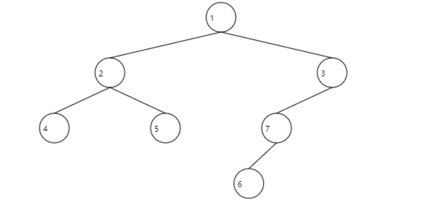
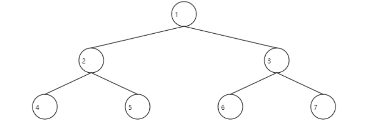
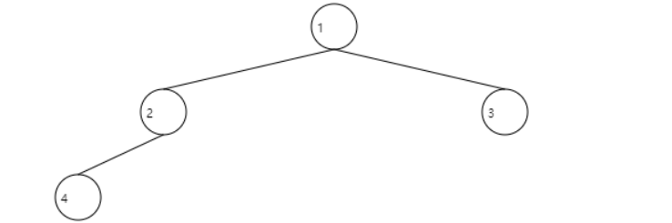
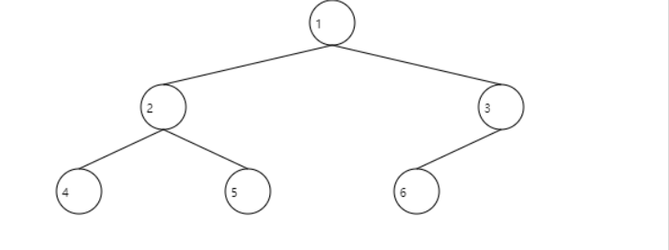
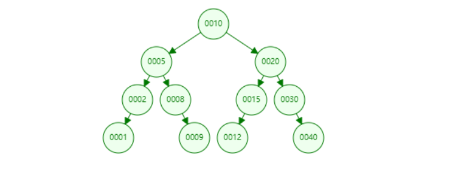
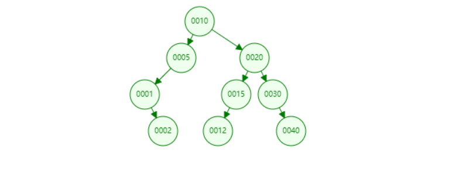
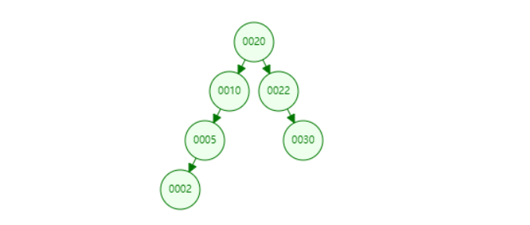
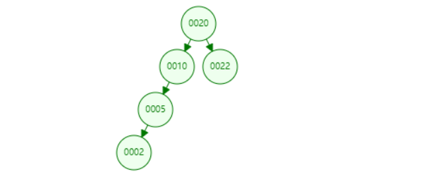

### JavaSE 摸鱼第23天...

#### 1、树的概念和术语

树（tree）是一种抽象数据类型（ADT）或是这种抽象数据类型的[数据结构](https://so.csdn.net/so/search?q=数据结构&spm=1001.2101.3001.7020)，用来模拟具有树状结构性质的数据集合。他是由 n （n>=1）个有限节点组成一个具有层次关系的集合。把他叫做“树”是因为它看起来像一颗倒挂的树，也就是说它是根朝上，而叶朝下的。它具有以下的特点：

- 每个节点有零个或多个子节点
- 没有父节点的节点称为根节点
- 每一个非根节点有且只有一个父节点
- 除了根节点外，每个子节点可以分为多个不相交的子树

树的术语：

+ `节点的度`：一个节点含有的子树的个数称为该节点的度；
+ `树的度`：一颗树中，最大的节点的度称为树的度；
+ `叶节点或终端节点`：度为0的节点；
+ `父节点`：若一个节点含有子节点，则这个节点称为其子节点的父节点；
+ `子节点`：一个节点含有的子树的根节点称为该节点的子节点；
+ `兄弟节点`：具有相同父节点的节点互称为兄弟节点
+ `节点的层次`：从根开始定义起，根为第一层，根的子节点为第二层，以此类推。
+ `树的高度或深度`：树中节点的最大层次；
+ `堂兄弟节点`：父节点在同一层的节点互为堂兄弟；
+ `节点的祖先`：从根到该节点所经分之上的所有节点；
+ `子孙`：以某节点为根的子树中任一节点都成为该节点的子孙。
+ `森林`：有 m (m >= 0) 棵互不相交的树的集合称为森林。

#### 2、树分类

##### 2.1、无序树

树中任意节点的子节点之间没有顺序关系，这种树称为无序树，也称为自由树。

##### 2.2、有序树

树中任意节点的子节点之间有顺序关系，这种树称为有序树。

+ 二叉树：每个节点最多含有两个子树的树称为二叉树。

  

  + 完全二叉树：

    + 是在最深层之外的每一个可能位置都有一个节点，在最深的那一层，节点按照从左到右的位置进行排列。

    + 对于一颗二叉树，假设其深度为 d (d>1)。除了第 d 层外，    其它各层的节点数据均已达到最大值，且 d 层所有节点从左向右连续地紧密排 列，这样的二叉树被称为完全二叉树。

    

    

    

    

  + 满二叉树：

    + 最下面一层，所有的节点都是叶节点（也就是说，所有的`叶节点`都处于`相同的深度`，并且每个非叶节点都具有两个子节点）。

    + 所有节点都在最底层的完全二叉树。

    

    

    

  

  + 排序二叉树(二叉查找树，Binary Search Tree)：也称为二叉搜索树、有序二叉树。

    + 若左子树不为空，则左子树上所有结点的值均小于其根结构的值。
    + 若右子树不为空，则右子树上所有结点的值均大于其根结构的值。

    

    

    

    

  

  + 平衡二叉树(AVL树)：

    + 当且仅当任何节点的两颗子树的高度差不大于 1 的二叉树。

    + 它是一棵空树或它的左右两个子树的高度差（称为平衡因子）不大于1的二叉排序树，并且左右两个子树都是一棵平衡二叉树。平衡二叉树的常用算法有红黑树、AVL、Treap等。

    + 图一(满足平衡二叉树)，图二(不满足平衡二叉树)

      

  

  

  

  + 红黑树：红黑树是一个二叉搜索树，它同时满足以下特性：

    + 每个节点要么是黑色，要么是红色。

    + 根节点是黑色。

    + 如果节点是红色的，那么它的子节点必须是黑色的（反之，不一定需要成立）。

    + 从根节点到叶节点或空子节点的每条路径，都包含相同数目的黑色节。

      

+ B树：一种对读写操作进行优化的自平衡的二叉查找树，能够驳斥数据有序，用户多余两个子树。

  

+ 霍夫曼树(用于信息编码)：带权路径最短的二叉树称为霍夫曼树或最优二叉树。

#### 2、二叉树遍历方式

+ 前序遍历
+ 中序遍历
+ 后续编译
+ 层级遍历