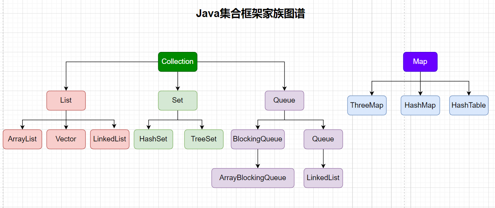

### JavaSE 摸鱼第24天...

#### 1、集合家族介绍

##### 1.1、集合介绍

Java集合就像一个容器，可以存储任何类型的数据，也可以结合泛型来存储具体的类型对象。在程序运行时，Java集合可以动态的进行扩展，随着元素的增加而扩大。在Java中，集合类通常存在于java.util包中。

##### 1.3、集合大家族图谱

Java集合主要由2大体系构成，分别是Collection体系和Map体系，其中Collection和Map分别是2大体系中的顶层接口。

Collection主要有三个子接口，分别为List(列表)、Set(集)、Queue(队列)。其中，List、Queue中的元素有序可重复，而Set中的元素无序不可重复。

List中主要有ArrayList、LinkedLis、Vectort三个实现类；Set中则是有HashSet实现类；而Queue是在JDK1.5后才出现的新集合，主要以数组和链表两种形式存在。

Map同属于java.util包中，是集合的一部分，但与Collection是相互独立的，没有任何关系。Map中都是以key-value的形式存在，其中key必须唯一，主要有HashMap、HashTable、treeMap三个实现类。





#### 2、List、Set、Map接口

##### 2.1、List接口基本使用

`ArrayList`、`LinkedList` 、`Vector` 都实现了 `List` 接口，所以他们三个用法大差不差，特点 `有序可重复`


+ `List`  接口的常用方法：

  ```java
  int size();
  
  boolean isEmpty();
  
  boolean contains(Object o);
  
  Iterator<E> iterator();
  
  Object[] toArray();
  
  <T> T[] toArray(T[] a);
  
  boolean add(E e);
  
  boolean remove(Object o);
  
  boolean containsAll(Collection<?> c);
  
  boolean addAll(Collection<? extends E> c);
  
  boolean addAll(int index, Collection<? extends E> c);
  
  boolean removeAll(Collection<?> c);
  
  boolean retainAll(Collection<?> c);
  
  void clear();
  
  boolean equals(Object o);
  
  int hashCode();
  
  E get(int index);
  
  E set(int index, E element);
  
  void add(int index, E element);
  
  E remove(int index);
  
  int indexOf(Object o);
  
  int lastIndexOf(Object o);
  
  ListIterator<E> listIterator();
  
  ListIterator<E> listIterator(int index);
  
  default void replaceAll(UnaryOperator<E> operator) {
      Objects.requireNonNull(operator);
      final ListIterator<E> li = this.listIterator();
      while (li.hasNext()) {
          li.set(operator.apply(li.next()));
      }
  }
  
  default void sort(Comparator<? super E> c) {
      Object[] a = this.toArray();
      Arrays.sort(a, (Comparator) c);
      ListIterator<E> i = this.listIterator();
      for (Object e : a) {
          i.next();
          i.set((E) e);
      }
  }
  ```

  

+ `ArrayList`

  ```java
  package com.ilovesshan.day24;
  
  import java.util.ArrayList;
  import java.util.List;
  
  /**
   * Created with IntelliJ IDEA.
   *
   * @author: ilovesshan
   * @date: 2022/7/29
   * @description: List接口  ArrayList 基本使用
   */
  public class UseArrayList {
      public static void main(String[] args) {
  
          // ArrayList 基本使用
          List<String> list = new ArrayList<>();
          List<String> list2 = new ArrayList<>();
          list2.add("1");
          list2.add("2");
  
          // 演示 C R U D
          list.add("a");
          list.add("b");
          list.add("c");
          list.addAll(1, list2);
  
  
          for (String s : list) {
              System.out.print(s);
          }
          System.out.println(); // a12bc
  
  
          list.set(0, "A");
  
  
          list.remove(4);
  
  
          for (int i = 0; i < list.size(); i++) {
              System.out.print(list.get(i));
          }
          System.out.println(); // A12b
  
      }
  }
  ```

  

+ `LinkedList`

  ```java
  package com.ilovesshan.day24;
  
  import java.util.LinkedList;
  import java.util.List;
  
  /**
   * Created with IntelliJ IDEA.
   *
   * @author: ilovesshan
   * @date: 2022/7/29
   * @description: List接口  LinkedList 基本使用
   */
  public class UseLinkedList {
      public static void main(String[] args) {
  
          //ArrayList 基本使用
          List<String> list = new LinkedList<>();
          List<String> list2 = new LinkedList<>();
          list2.add("1");
          list2.add("2");
  
          // 演示 C R U D
          list.add("a");
          list.add("b");
          list.add("c");
          list.addAll(1, list2);
  
  
          for (String s : list) {
              System.out.print(s);
          }
          System.out.println(); // a12bc
  
  
          list.set(0, "A");
  
  
          list.remove(4);
  
  
          for (int i = 0; i < list.size(); i++) {
              System.out.print(list.get(i));
          }
          System.out.println(); // A12b
  
      }
  }
  
  ```

  

+ Vector

  ```java
  package com.ilovesshan.day24;
  
  import java.util.List;
  import java.util.Vector;
  
  /**
   * Created with IntelliJ IDEA.
   *
   * @author: ilovesshan
   * @date: 2022/7/29
   * @description: List接口  Vector 基本使用
   */
  public class UseVector {
      public static void main(String[] args) {
  
          //ArrayList 基本使用
          List<String> list = new Vector<>();
          List<String> list2 = new Vector<>();
          list2.add("1");
          list2.add("2");
  
          // 演示 C R U D
          list.add("a");
          list.add("b");
          list.add("c");
          list.addAll(1, list2);
  
  
          for (String s : list) {
              System.out.print(s);
          }
          System.out.println(); // a12bc
  
  
          list.set(0, "A");
  
  
          list.remove(4);
  
  
          for (int i = 0; i < list.size(); i++) {
              System.out.print(list.get(i));
          }
          System.out.println(); // A12b
  
      }
  }
  
  ```

  

##### 2.2、Set基本使用

`HashSet`、`ThreeSet(继承AbstractSet，AbstractSet实现Set)` 接口，间接性都实现了 `Set` 接口，特点 `无序 不重复`


+ `HashSet`和`ThreeSet` 用法差不多，下面演示 `UseHashSet`

  ```java
  package com.ilovesshan.day23;
  
  import java.util.HashSet;
  import java.util.Iterator;
  
  /**
   * Created with IntelliJ IDEA.
   *
   * @author: ilovesshan
   * @date: 2022/7/29
   * @description: HashSet基本使用
   */
  public class UseHashSet {
      public static void main(String[] args) {
          HashSet<String> hashSet = new HashSet<>();
  
          // 添加元素
          hashSet.add("5");
          hashSet.add("4");
          hashSet.add("5");
          hashSet.add("3");
          hashSet.add("2");
          hashSet.add("1");
          hashSet.add("0");
          hashSet.add("a");
          hashSet.add("a");
          hashSet.add("b");
          hashSet.add("c");
          hashSet.add("d");
          hashSet.add("e");
          hashSet.add("f");
  
          // 无序 不重复
          System.out.println(hashSet); // [0, 1, a, 2, b, 3, c, 4, d, 5, e, f]
  
  
          hashSet.remove("a");
          hashSet.remove("5");
  
          System.out.println(hashSet); // [0, 1, 2, b, 3, c, 4, d, e, f]
  
  
          // 长度
          System.out.println(hashSet.size()); // 10
  
          // 使用 Iterator 遍历
          Iterator<String> iterator = hashSet.iterator();
          while (iterator.hasNext()) {
              System.out.println(iterator.next());
          }
      }
  }

##### 2.3、Map基本使用

#### 3、List源码流程

#### 4、Set源码流程